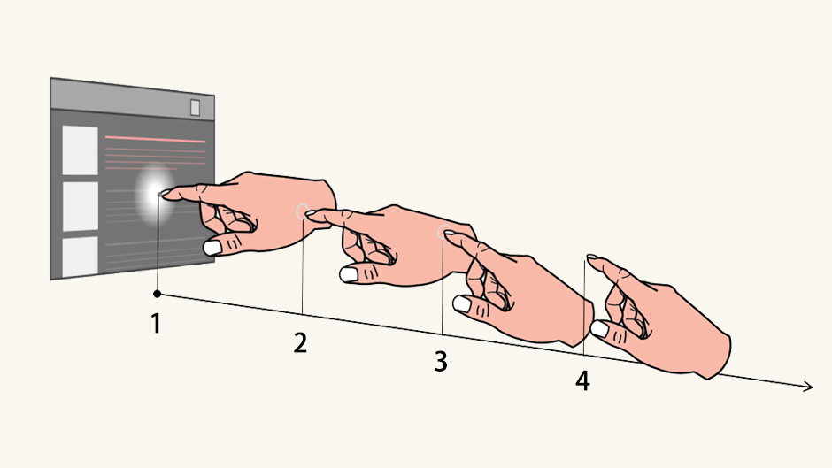
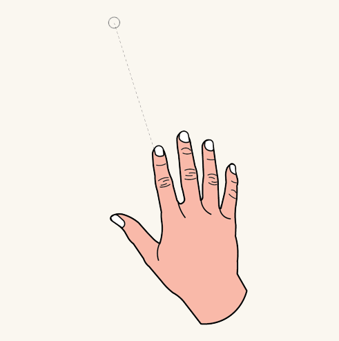
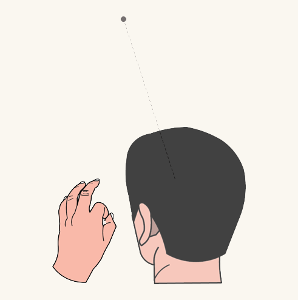
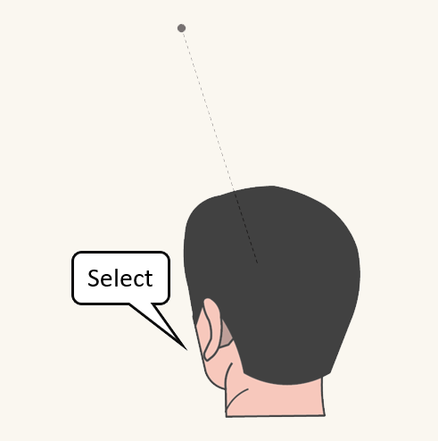

# Cursors

A cursor provides continuous feedback based on where the headset believes a users current focus is at a given time. Cursor feedback includes what area, hologram, or point in the virtual environment responds to input. Even though the cursor is a digital representation of where the device understands the user's attention to be, that's not the same as determining the user's intentions. The cursor feedback also lets users know what system responses to expect. You can use the feedback to communicate their intention to the device, which increases user confidence.

There are 3 kinds of cursors: **finger, ray**, and **head-gaze**. These pointing cursors work with different input modalities on HoloLens, HoloLens 2, and immersive headsets. Below is guidance on which type of cursor to use for each type of headset and interaction model. In the Mixed Reality Toolkit (MRTK), we've created drag-and-drop cursors modules to help you build the right pointing experience.

## Device support

<table>
    <colgroup>
    <col width="25%" />
    <col width="25%" />
    <col width="25%" />
    <col width="25%" />
    </colgroup>
    <tr>
        <td><strong>Feature</strong></td>
        <td><a href="/hololens/hololens1-hardware"><strong>HoloLens (1st gen)</strong></a></td>
        <td><a href="https://docs.microsoft.com/hololens/hololens2-hardware"><strong>HoloLens 2</strong></td>
        <td><a href="../discover/immersive-headset-hardware-details.md"><strong>Immersive headsets</strong></a></td>
    </tr>
     <tr>
        <td>Finger cursor</td>
        <td>❌</td>
        <td>✔️</td>
        <td>❌</td>
    </tr>
     <tr>
        <td>Ray cursor</td>
        <td>❌</td>
        <td>✔️</td>
        <td>✔️</td>
    </tr>
    <tr>
        <td>Head-gaze cursor</td>
        <td>✔️</td>
        <td>✔️</td>
        <td>✔️</td>
    </tr>
</table>

## Finger cursor

The finger cursor is only available on the HoloLens 2 to enhance the "[direct manipulation with hands](direct-manipulation.md)" interaction mode. We've attached rings to the tips of both index fingers to better understand where the finger is pointing. The ring size is based on the proximity of the finger to the UI surface, which shrinks to a small dot when the finger touches the UI. The closer the finger, the smaller the ring.  

 
**Visual feedback states of finger cursor**
1: The ring shrinks to a dot. 2: The ring aligns with surface. 3: The ring is perpendicular to finger vector. 4: No ring.

## Ray cursor

Ray cursors attach to the end of far pointing rays to allow manipulation of objects that are out of hands-reach. In immersive headsets, the rays shoot out from motion controllers and end in dot cursors. In HoloLens 2, we apply the mental model of these motion controller rays and designed hand rays that originate from the palms and end in ring-shaped cursors that are consistent with finger cursors used in direct manipulation.  
:::row:::
    :::column:::
         
        **Ray cursors of motion controllers** 
    :::column-end:::
    :::column:::
         
        **Ray cursors of hands** 
    :::column-end:::
:::row-end:::

 

---

## Head-gaze cursor

The head-gaze cursor is a dot that attaches to the end of an invisible head-gaze vector that uses the position and rotation of the head to point. To execute actions, this pointing cursor is paired with various commit inputs such as air tap, voice commands, dwell, and button press. In HoloLens 2, head-gaze is best paired with any commit input that isn't air tap, as there will be interaction conflict between air tap and far hand rays.  
:::row:::
    :::column:::
         
        **Head-gaze cursor with hand gesture** 
    :::column-end:::
    :::column:::
         
        **Head-gaze cursor with voice command** 
    :::column-end:::
:::row-end:::

 

---

## Cursor customization recommendations

If you would like to customize the cursor feedback behaviors and appearances, here are some design recommendations:

### Cursor scale

* The cursor should be no larger than the available targets, allowing users to easily interact with and view the content.
* Depending on the experience you create, scaling the cursor as the user looks around is also an important consideration. For example, as the user looks further away in your experience, the cursor shouldn't become too small such that it's lost.
* When scaling the cursor, consider applying a soft animation to it as it scales to give it an organic feeling.
* Avoid obstructing content. Holograms are what make the experience memorable and the cursor shouldn't be taking away from them.

### Directionless cursor shape

* Although there's no one right cursor shape, we recommend that you use a directionless shape like a torus. A cursor that points in some direction (For example, a traditional arrow cursor) might confuse the user to always look that way.
* An exception to this is when using the cursor to communicate interaction instruction to the user. For example, when scaling holograms in the Mixed Reality OS, the cursor temporarily includes arrows that instructs the user on how to move their hand to scale the hologram.

### Look and feel

* A donut or torus shaped cursor works for many applications.
* Pick a color and shape that best represents the experience you're creating.
* Cursors are especially prone to [color separation](../develop/platform-capabilities-and-apis/hologram-stability.md#color-separation).
* A small cursor with balanced opacity keeps it informative without dominating the visual hierarchy.
* Be cognizant of using shadows or highlights behind your cursor as they might obstruct content and distract from the task at hand.
* Cursors should align to and hug the surfaces in your app. Users will have a feeling that the system can see where they're looking, but also that the system is aware of their surroundings. For example, the cursor in the Mixed Reality OS aligns to the surfaces of the user's world, creating a feeling of awareness of the world even when the user isn't looking directly at a hologram.
* Magnetically locking the cursor to an interactive element when it's close to the user can help improve confidence that user will interact with that element when they use a selection action.

### Visual cues

* If your experience is focused on a single hologram, your cursor should align and hug only that hologram and change shape when you look away from that hologram. This can convey to the user that the hologram is actionable and they can interact with it.
* If your application uses spatial mapping, then your cursor could align and hug every surface it sees. This gives feedback to the users that HoloLens and your application can see their space. This reinforces the fact that holograms are real and in our world and helps bridge the gap between real and virtual.
* Have an idea of what the cursor should do when there are no holograms or surfaces in view. Placing it at a predetermined distance in front of the user is one option.

### Possible actions

* The cursor can be represented by different icons to convey possible actions a hologram can do, such as scaling or rotation.
* Only add extra information on the cursor if it means something to the user. Otherwise, users might either not notice the state changes or get confused by the cursor.

### Input state

* We could use the cursor to display the user's input state or intent. For example, we could display an icon telling the user the system sees their hand state and that the application knows they're ready to take action.
* We could also use the cursor to show users that voice commands have been heard by the system via a momentary color change

* The following cursor states can be implemented in different ways. You might implement these different states by modeling the cursor like a state machine. For example:
    * Idle state is where you show the default cursor.
    * Ready state is when you've detected the user's hand in the ready position.
    * Interaction state is when the user is doing a particular interaction.
    * Possible Actions state or hover state is when you convey possible actions that can be performed on a hologram.

You could also implement these states in a skin-able manner to display different art assets when you detect different states.

 

---

## Going "cursor-free"

Designing without a cursor is recommended when the sense of immersion is a key component of an experience and when pointing interactions (through gaze and gesture) don't require great precision. The system still needs to meet the normal requirements of a cursor: providing users with continuous feedback on the system's understanding of their pointing, and helping them to communicate their intentions to the system. This may be achievable through other noticeable state changes.

 

---

## Cursor in MRTK (Mixed Reality Toolkit) for Unity

By default, [MRTK](https://github.com/Microsoft/MixedRealityToolkit-Unity) provides a cursor prefab([DefaultCursor.prefab](https://github.com/microsoft/MixedRealityToolkit-Unity/tree/mrtk_release/Assets/MixedRealityToolkit.SDK/Features/UX/Prefabs/Cursors)) which has the same visual state as the shell's system cursor. It's assigned in MRTK's Input profile, under Pointers. You can replace/customize this cursor for your experience. For the experience with eye-tracking input, MRTK also provides EyeGazeCursor, which has subtle visual to minimize the distraction.

* [MRTK - Pointer profile](https://docs.microsoft.com/windows/mixed-reality/mrtk-docs/mixed-reality-configuration-guide.md#pointer-configuration)
* [MRTK - Input system](https://docs.microsoft.com/windows/mixed-reality/mrtk-docs/features/input/overview.md)
* [MRTK - Pointers](https://docs.microsoft.com/windows/mixed-reality/mrtk-docs/features/input/pointers.md)

---

## See also

* [Gestures](gaze-and-commit.md#composite-gestures)
* [Head-gaze and commit](gaze-and-commit.md)