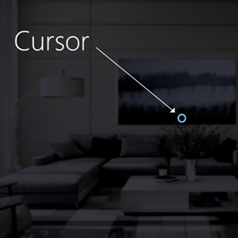
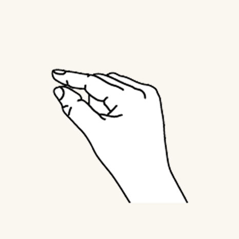
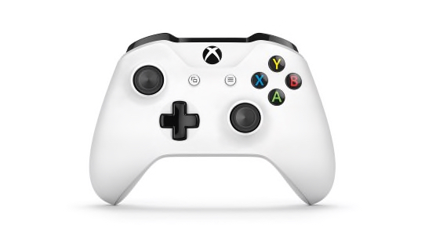
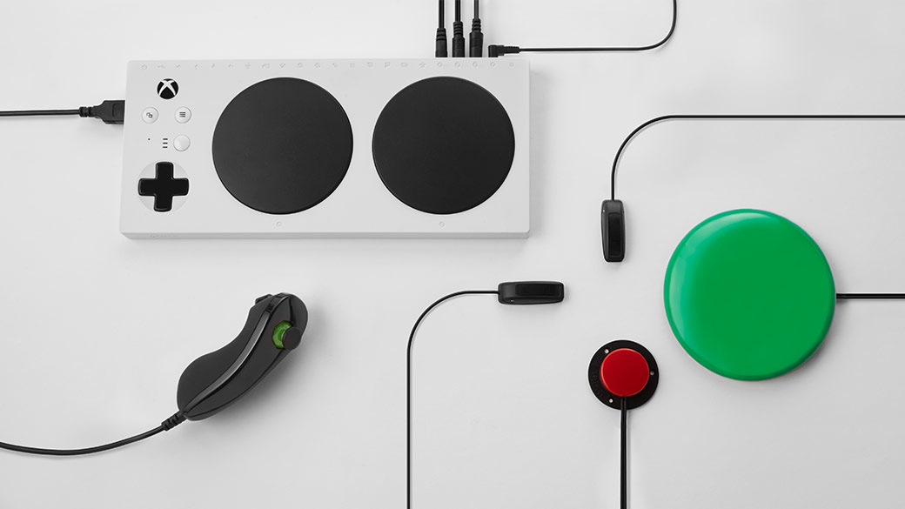

# Gaze and commit

_Gaze and commit_ is a fundamental input model that is closely related to the way we're interacting with our computers using the mouse: _Point & click_. On this page, we introduce two types of gaze input (head- and eye-gaze) and different types of commit actions. _Gaze and commit_ is considered a far input model with indirect manipulation. It's best used for interacting with holographic content that is out of reach.

Mixed reality headsets can use the position and orientation of the user's head to determine their head direction vector. Think of gaze as a laser pointing straight ahead from directly between the user's eyes. This is a fairly coarse approximation of where the user is looking. Your application can intersect this ray with virtual or real-world objects, and draw a cursor at that location to let the user know what they're targeting.

In addition to head gaze, some mixed reality headsets, such as HoloLens 2, include eye tracking systems that produce an eye-gaze vector. This provides a fine-grained measurement of where the user is looking. In both cases, the gaze represents an important signal for the user's intent. The better the system can interpret and predict the user's intended actions, the more user satisfaction and performance improves.

Below are a few examples for how you as a mixed reality developer can benefit from head- or eye-gaze:
* Your app can intersect gaze with the holograms in your scene to determine where the user's attention is (more precise with eye-gaze).
* Your app can channel gestures and controller presses based on the user's gaze, which lets the user seamlessly select, activate, grab, scroll, or otherwise interact with their holograms.
* Your app can let the user place holograms on real-world surfaces by intersecting their gaze ray with the spatial mapping mesh.
* Your app can know when the user isn't looking in the direction of an important object, which can lead your app to give visual and audio cues to turn towards that object.

 

## Device support

<table>
    <colgroup>
    <col width="25%" />
    <col width="25%" />
    <col width="25%" />
    <col width="25%" />
    </colgroup>
    <tr>
        <td><strong>Input model</strong></td>
        <td><a href="/hololens/hololens1-hardware"><strong>HoloLens (1st gen)</strong></a></td>
        <td><a href="https://docs.microsoft.com/hololens/hololens2-hardware"><strong>HoloLens 2</strong></td>
        <td><a href="../discover/immersive-headset-hardware-details.md"><strong>Immersive headsets</strong></a></td>
    </tr>
     <tr>
        <td>Head-gaze and commit</td>
        <td>✔️ Recommended</td>
        <td>✔️ Recommended (third choice - <a href="interaction-fundamentals.md">See the other options</a>)</td>
        <td>➕ Alternate option</td>
    </tr>
	     <tr>
        <td>Eye-gaze and commit</td>
        <td>❌ Not available</td>
        <td>✔️ Recommended (third choice - <a href="interaction-fundamentals.md">See the other options</a>)</td>
        <td>❌ Not available</td>
    </tr>
</table>

## Gaze

### Eye- or head-gaze?
There are several considerations when faced with the question whether you should use the "eye-gaze and commit" or "head-gaze and commit" input model. 
If you're developing for an immersive headset or for HoloLens (1st gen), then the choice is simple: Head-gaze and commit. 
If you're developing for HoloLens 2, the choice becomes a little harder. It's important to understand the advantages and challenges that come with each of them.
We compiled some broad pro's and con's in the table below to contrast head- vs. eye-gaze targeting. 
This is far from complete and we suggest learning more about eye-gaze targeting in mixed reality here:
* [Eye tracking on HoloLens 2](eye-tracking.md): General introduction of our new eye tracking capability on HoloLens 2 including some developer guidance. 
* [Eye-gaze interaction](eye-gaze-interaction.md): Design considerations and recommendations when planning to use eye tracking as an input.

<table>
    <colgroup>
    <col width="25%" />
    <col width="25%" />
    <col width="25%" />
    <col width="25%" />
    </colgroup>
   <tr>
        <td><strong>Eye-gaze targeting</strong></td>
        <td><strong>Head-gaze targeting</strong></td>
    </tr>
    <tr>
        <td>Fast!</td>
        <td>Slower</td>
    </tr>
    <tr>
        <td>Low effort (barely any body movements necessary)</td>
        <td>Can be fatiguing - Possible discomfort (for example, neck strain)</td>
    </tr>
    <tr>
        <td>Doesn't require a cursor, but subtle feedback is recommended</td>
        <td>Requires to show a cursor</td>
    </tr>
    <tr>
        <td>No smooth eye movements – for example, not good for drawing</td>
        <td>More controlled and explicit</td>
    </tr>
    <tr>
        <td>Difficult for small targets (for example, tiny buttons or weblinks)</td>
        <td>Reliable! Great fallback!</td>
    </tr>
    <tr>
        <td>...</td>
        <td>...</td>
    </tr>
</table>

Whether you use head-gaze or eye-gaze for your gaze-and-commit input model, each comes with different sets of design constraints. These are covered separately in the [eye-gaze and commit](gaze-and-commit-eyes.md) and [head-gaze and commit](gaze-and-commit-head.md) articles.

 

---

### Cursor

:::row:::
    :::column:::
        For head gaze, most apps should use a [cursor](cursors.md) or other auditory/visual indication to give the user confidence in what they're about to interact with. 
        You typically position this cursor in the world where their head gaze ray first intersects an object, which may be a hologram or a real-world surface. 
         
        For eye gaze, we generally recommend *not* to show a cursor, as this can quickly become distracting and annoying for the user. 
        Instead subtly highlight visual targets or use a faint eye cursor to provide confidence about what the user is about to interact with. For more information, please check out our [design guidance for eye-based input](eye-tracking.md) on HoloLens 2.
    :::column-end:::
        :::column:::
        
       *Image: An example visual cursor to show gaze*
    :::column-end:::
:::row-end:::

 

---

## Commit
After talking about different ways to _gaze_ at a target, let's talk a bit more about the _commit_ part in _gaze and commit_.
After targeting an object or UI element, the user can interact or click on it using a secondary input. 
This is known as the commit step of the input model. 

The following commit methods are supported:
- Air tap hand gesture (that is, raise your hand in front of you and bring together your index finger and thumb)
- Say _"select"_ or one of the targeted voice commands
- Press a single button on a [HoloLens Clicker](/hololens/hololens1-clicker)
- Press the 'A' button on an Xbox gamepad
- Press the 'A' button on an Xbox adaptive controller

### Gaze and air tap gesture
Air tap is a tapping gesture with the hand held upright. 
To use an air tap, raise your index finger to the ready position, then pinch with your thumb, and raise your index finger back up to release. 
On HoloLens (1st gen), air tap is the most common secondary input.

:::row:::
    :::column:::
        
       **Finger in the ready position** 
    :::column-end:::
    :::column:::
        
        **Press finger down to tap or click** 
    :::column-end:::
:::row-end:::

Air tap is also available on HoloLens 2. 
It has been relaxed from the original version. 
Nearly all types of pinches are now supported as long as the hand is upright and holding still. 
This makes it much easier for users to learn and use the gesture. 
This new air tap replaces the old one through the same API, so existing applications will have the new behavior automatically after recompiling for HoloLens 2.

 

---

### Gaze and "Select" voice command
Voice commanding is one of the primary interaction methods in mixed reality. 
It provides a powerful hands-free mechanism to control the system. 
There are different types of voice interaction models:

- The generic "Select" command that uses a click actuation or commit as a secondary input.
- Object commands (for example, "Close" or "Make it bigger") perform and commit to an action as a secondary input.
- Global commands (for example, "Go to start") don't require a target.
- Conversation user interfaces or entities like Cortana have an AI natural language capability.
- Custom voice commands

To find out more about details and a comprehensive list of available voice commands and how to use them, check out our [voice commanding](../out-of-scope/voice-design.md) guidance.

 

---

### Gaze and HoloLens Clicker

:::row:::
    :::column:::
        The HoloLens Clicker is the first peripheral device built specifically for HoloLens. It's included with HoloLens (1st gen) Development Edition. The HoloLens Clicker lets a user click with minimal hand motion, and commit as a secondary input. The HoloLens Clicker connects to HoloLens (1st gen) or HoloLens 2 using Bluetooth Low Energy (BTLE). 
         
        [More information and instructions to pair the device](../discover/hardware-accessories.md#pairing-bluetooth-accessories) 
         
        *Image: HoloLens Clicker*
    :::column-end:::
        :::column:::
        
    :::column-end:::
:::row-end:::

 

---

### Gaze and Xbox Wireless Controller

:::row:::
    :::column:::
        The Xbox Wireless Controller performs a click actuation as a secondary input by using the 'A' button. The device is mapped to a default set of actions that help navigate and control the system. If you want to customize the controller, use the Xbox Accessories application to configure your Xbox Wireless Controller. 
         
        [How to pair an Xbox controller with your PC](../discover/hardware-accessories.md#pairing-bluetooth-accessories) 
         
        *Image: Xbox Wireless Controller*
    :::column-end:::
        :::column:::
        
    :::column-end:::
:::row-end:::

 

---

### Gaze and Xbox Adaptive Controller
Designed primarily to meet the needs of gamers with limited mobility, the Xbox Adaptive Controller is a unified hub for devices that helps make mixed reality more accessible.

The Xbox Adaptive Controller performs a click actuation as a secondary input by using the 'A' button. The device is mapped to a default set of actions that help navigate and control the system. If you want to customize the controller, use the Xbox Accessories application to configure your Xbox Adaptive Controller.

 
*Xbox Adaptive Controller*

Connect external devices such as switches, buttons, mounts, and joysticks to create a custom controller experience that is uniquely yours. Button, thumbstick, and trigger inputs are controlled with assistive devices connected through 3.5-mm jacks and USB ports.

 
*Xbox Adaptive Controller ports*

[Instructions to pair the device](../discover/hardware-accessories.md#pairing-bluetooth-accessories)

<a href=https://www.xbox.com/xbox-one/accessories/controllers/xbox-adaptive-controller>More info available on the Xbox site</a>

 

---

## Composite gestures

### Air tap
The air tap gesture (and the other gestures below) reacts only to a specific tap. To detect other taps, such as Menu or Grasp, your application must directly use the lower-level interactions described in the two key component gestures section above.

### Tap and hold
Hold is simply maintaining the downward finger position of the air tap. The combination of air tap and hold allows for various more complex "click and drag" interactions when combined with arm movement such as picking up an object instead of activating it or mousedown secondary interactions such as showing a context menu.
Caution should be used when designing for this gesture however, as users can be prone to relaxing their hand postures during any extended gesture.

### Manipulation
Manipulation gestures can be used to move, resize, or rotate a hologram when you want the hologram to react 1:1 to the user's hand movements. One use for such 1:1 movements is to let the user draw or paint in the world.
The initial targeting for a manipulation gesture should be done by gaze or pointing. Once the tap and hold starts, any object manipulation is handled by hand movements, which frees the user to look around while they manipulate.

### Navigation
Navigation gestures operate like a virtual joystick, and can be used to navigate UI widgets, such as radial menus. You tap and hold to start the gesture and then move your hand within a normalized 3D cube, centered around the initial press. You can move your hand along the X, Y, or Z axis from a value of -1 to 1, with 0 being the starting point.
Navigation can be used to build velocity-based continuous scrolling or zooming gestures, similar to scrolling a 2D UI by clicking the middle mouse button and then moving the mouse up and down.

Navigation with rails refers to the ability of recognizing movements in certain axis until a certain threshold is reached on that axis. This is only useful when movement in more than one axis is enabled in an application by the developer, such as if an application is configured to recognize navigation gestures across X, Y axis but also specified X axis with rails. In this case, the system will recognize hand movements across X axis as long as they remain within an imaginary rails (guide) on the X axis, if hand movement also occurs on the Y axis.

Within 2D apps, users can use vertical navigation gestures to scroll, zoom, or drag inside the app. This injects virtual finger touches to the app to simulate touch gestures of the same type. Users can select which of these actions take place by toggling between the tools on the bar above the application, either by selecting the button or saying '<Scroll/Drag/Zoom> Tool'.

[More info on composite gestures](gaze-and-commit.md#composite-gestures)

## Gesture recognizers

One benefit of using gesture recognition is that you can configure a gesture recognizer only for the gestures the currently targeted hologram can accept. The platform only does disambiguation as necessary to distinguish those particular supported gestures. In this way, a hologram that just supports air tap can accept any length of time between press and release, while a hologram that supports both tap and hold can promote the tap to a hold after the hold time threshold.

## Hand recognition
HoloLens recognizes hand gestures by tracking the position of either or both hands that are visible to the device. HoloLens sees hands when they are in either the ready state (back of the hand facing you with index finger up) or the pressed state (back of the hand facing you with the index finger down). When hands are in other poses, HoloLens ignores them.
For each hand that HoloLens detects, you can access its position without orientation and its pressed state. As the hand nears the edge of the gesture frame, you're also provided with a direction vector, which you can show to the user so they know how to move their hand to get it back where HoloLens can see it.

## Gesture frame
For gestures on HoloLens, the hand must be within a gesture frame, in a range that the gesture-sensing cameras can see appropriately,  from nose to waist and between the shoulders. Users need to be trained on this area of recognition both for success of action and for their own comfort. Many users will initially assume that the gesture frame must be within their view through HoloLens, and hold up their arms uncomfortably to interact. When using the HoloLens Clicker, it's not necessary for hands to be within the gesture frame.

For continuous gestures in particular, there's some risk of users moving their hands outside of the gesture frame while in mid-gesture when moving a holographic object, for example, and losing their intended outcome.

There are three things that you should consider:

- User education on the gesture frame's existence and approximate boundaries. This is taught during HoloLens setup.

- Notifying users when their gestures are nearing or breaking the gesture frame boundaries within an application to the degree that a lost gesture leads to undesired outcomes. Research has shown the key qualities of such a notification system. The HoloLens shell provides a good example of this type of notification--visual, on the central cursor, indicating the direction in which boundary crossing is taking place.

- Consequences of breaking the gesture frame boundaries should be minimized. In general, this means that the outcome of a gesture should be stopped at the boundary, and not reversed. For example, if a user is moving some holographic object across a room, the movement should stop when the gesture frame is breached, and not returned to the starting point. The user might experience some frustration, but might more quickly understand the boundaries, and not have to restart their full intended actions each time.

## See also
* [Eye-based interaction](eye-gaze-interaction.md)
* [Eye tracking on HoloLens 2](eye-tracking.md)
* [Gaze and dwell](gaze-and-dwell.md)
* [Hands - Direct manipulation](direct-manipulation.md)
* [Hands - Gestures](gaze-and-commit.md#composite-gestures)
* [Hands - Point and commit](point-and-commit.md)
* [Instinctual interactions](interaction-fundamentals.md)
* [Voice input](voice-input.md)