# Point and commit with hands

Point and commit with hands is an input model that lets users target, select, and manipulate out of reach 2D and 3D content. This "far" interaction technique is unique to mixed reality because humans don't naturally interact with the real world that way. For example, in the super hero movie, *X-Men*, the character [Magneto](https://en.wikipedia.org/wiki/Magneto_(comics)) can manipulate far objects in the distance with his hands. This isn't something humans can do in reality. In both HoloLens (AR) and Mixed Reality (MR), we equip users with this magical power to break the physical constraint of the real world. Not only is it a fun holographic experience, but it also makes user interactions more effective and efficient.

## Device support

<table>
<colgroup>
    <col width="33%" />
    <col width="22%" />
    <col width="22%" />
    <col width="22%" />
</colgroup>
<tr>
     <td><strong>Input model</strong></td>
     <td><a href="/hololens/hololens1-hardware"><strong>HoloLens (1st gen)</strong></a></td>
     <td><a href="https://docs.microsoft.com/hololens/hololens2-hardware"><strong>HoloLens 2</strong></td>
     <td><a href="../discover/immersive-headset-hardware-details.md"><strong>Immersive headsets</strong></a></td>
</tr>
<tr>
     <td>Point and commit with hands</td>
     <td>❌ Not supported</td>
     <td>✔️ Recommended</td>
     <td>✔️ Recommended</td>
</tr>
</table>

_"Point and commit with hands"_ is one of the new features that use the new articulated hand-tracking system. 
This input model is also the primary input model on immersive headsets by using motion controllers.

 

---

## Hand rays

On HoloLens 2, we created a hand ray that shoots out from the center of the user's palm. This ray is treated as an extension of the hand. A donut-shaped cursor is attached to the end of the ray to indicate the location where the ray intersects with a target object. The object that the cursor lands on can then receive gestural commands from the hand.

This basic gestural command is triggered by using the thumb and index finger to do the air-tap action. By using the hand ray to point and air tap to commit, users can activate a button or a hyperlink. With more composite gestures, users can navigating web content and manipulating 3D objects from a distance. The visual design of the hand ray should also react to these point and commit states, as described and shown below: 

:::row:::
    :::column:::
        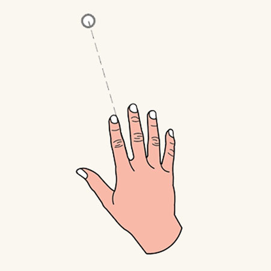 
        **Pointing state** 
        In the *pointing* state, the ray is a dash line and the cursor is a donut shape.
    :::column-end:::
    :::column:::
        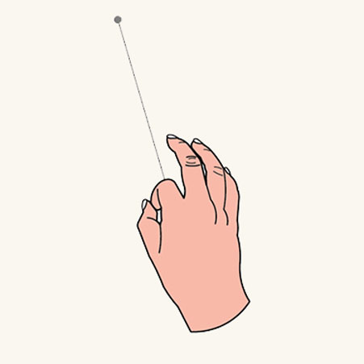 
        **Commit state** 
        In the *commit* state, the ray turns into a solid line and the cursor shrinks to a dot.
    :::column-end:::
:::row-end:::

 

---

## Transition between near and far

Instead of using specific gestures like "pointing with index finger" to direct the ray, we designed the ray to comout out from the center of the users' palm. This way, we've released and reserved the Five Fingers for more manipulative gestures like pinch and grab. With this design, we create only one mental model - the same set of hand gestures are used for both near and far interaction. You can use the same grab gesture to manipulate objects at different distances. The invocation of the rays is automatic and proximity-based as follows:

:::row:::
    :::column:::
        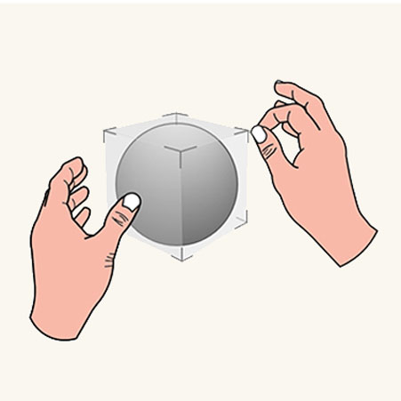 
        **Near manipulation** 
        When an object is within arm's length (roughly 50 cm), the rays are turned off automatically, encouraging near interaction.
    :::column-end:::
    :::column:::
        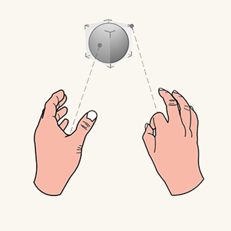 
        **Far manipulation** 
        When the object is farther than 50 cm, the rays are turned on. The transition should be smooth and seamless.
    :::column-end:::
:::row-end:::

 

---

## 2D slate interaction

A 2D slate is a holographic container hosting 2D app contents, such as a web browser. The design concept for far interacting with a 2D slate is to use hand rays to target and air tap to select. After targeting with a hand ray, users can air tap to trigger a hyperlink or a button. They can use one hand to "air tap and drag" to scroll slate content up and down. The relative motion of using two hands to air tap and drag can zoom in and out the slate content.

Targeting the hand ray at the corners and edges reveals the closest manipulation affordance. By "grab and drag" manipulation affordances, users can do uniform scaling through the corner affordances, and can reflow the slate via the edge affordances. Grabbing and dragging the holobar at the top of the 2D slate lets users move the entire slate.

:::row:::
    :::column:::
       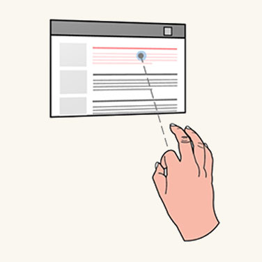 
       **Click** 
    :::column-end:::
    :::column:::
       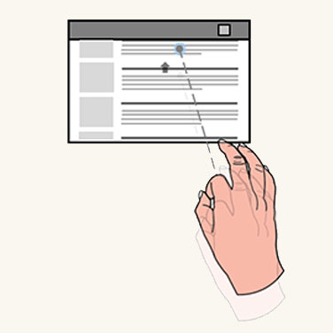 
        **Scroll** 
    :::column-end:::
    :::column:::
       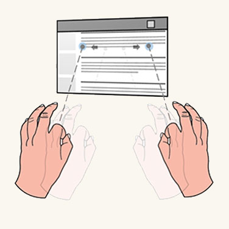 
       **Zoom** 
    :::column-end:::
:::row-end:::

 

**For manipulating the 2D slate** 

* Users point the hand ray at the corners or edges to reveal the closest manipulation affordance. 
* By applying a manipulation gesture on the affordance, users can do uniform scaling through the corner affordance, and can reflow the slate via the edge affordance. 
* By applying a manipulation gesture on the holobar at the top of the 2D slate, users can move the entire slate. 

 

---

## 3D object manipulation

In direct manipulation, there are two ways for users to manipulate 3D objects: affordance-based manipulation and non-affordance based manipulation. In the point and commit model, users can achieve exactly the same tasks through the hand rays. No extra learning is needed. 

### Affordance-based manipulation

Users use hand rays to point and reveal the bounding box and manipulation affordances. Users can apply the manipulation gesture on the bounding box to move the whole object, on the edge affordances to rotate, and on the corner affordances to scale uniformly.  

:::row:::
    :::column:::
       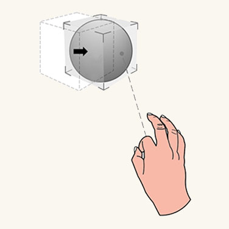 
       **Move** 
    :::column-end:::
    :::column:::
       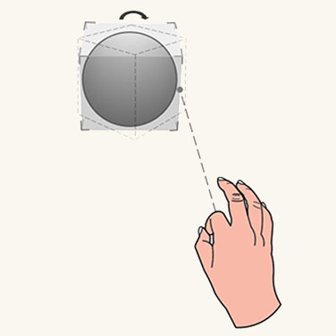 
        **Rotate** 
    :::column-end:::
    :::column:::
       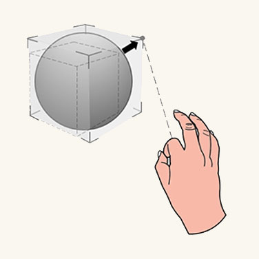 
       **Scale** 
    :::column-end:::
:::row-end:::

### Non-affordance-based manipulation

Users point with hand rays to reveal the bounding box then directly apply manipulation gestures on it. With one hand, the translation and rotation of the object are associated to motion and orientation of the hand. With two hands, users can translate, scale, and rotate it according to relative motions of two hands. 

 

---

## Instinctual gestures

The concept of instinctual gestures for point and commit is similar to that for [direct manipulation with hands](direct-manipulation.md). The gestures users do on a 3D object are guided by the design of UI affordances. For example, a small control point might motivate users to pinch with their thumb and index finger, while a user might want to use all Five Fingers to grab a larger object.

:::row:::
    :::column:::
       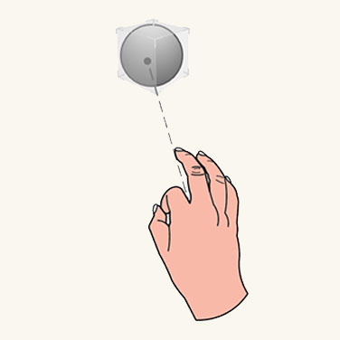 
       **Small object** 
    :::column-end:::
    :::column:::
        
        **Medium object** 
    :::column-end:::
    :::column:::
       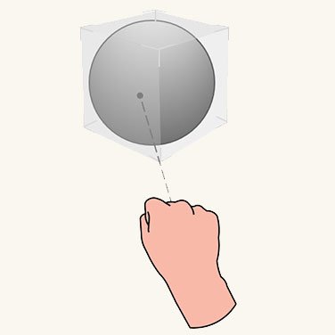 
       **Large object** 
    :::column-end:::
:::row-end:::

 

---

## Symmetric design between hands and 6 DoF controller 

The concept of point and commit for far interaction was created and defined for the Mixed Reality Portal (MRP). In this scenario, a user wears an immersive headset and interacts with 3D objects via motion controllers. The motion controllers shoot out rays for pointing and manipulating far objects. There are buttons on the controllers for further committing different actions. We apply the interaction model of rays and attached them to both hands. With this symmetric design, users who are familiar with MRP won't need to learn another interaction model for far pointing and manipulation when they use HoloLens 2, and the other way around.    

:::row:::
    :::column:::
        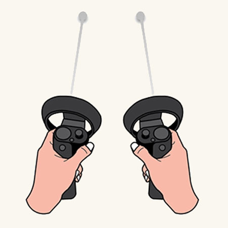 
        **Controller rays** 
    :::column-end:::
    :::column:::
        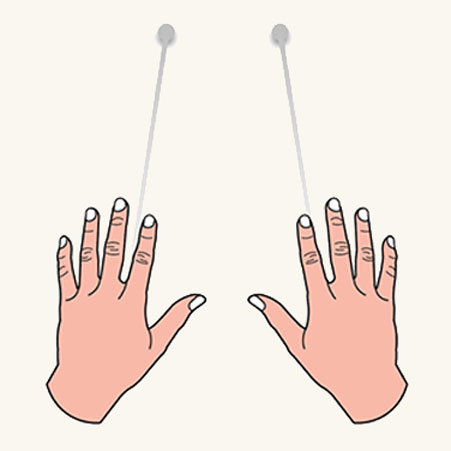 
        **Hand rays** 
    :::column-end:::
:::row-end:::

 

---

## Hand ray in MRTK (Mixed Reality Toolkit) for Unity

By default, MRTK provides a hand ray prefab ([DefaultControllerPointer.prefab](https://github.com/microsoft/MixedRealityToolkit-Unity/tree/mrtk_release/Assets/MixedRealityToolkit.SDK/Features/UX/Prefabs/Pointers)) which has the same visual state as the shell's system hand ray. It's assigned in MRTK's Input profile, under Pointers. In an immersive headset, the same rays are used for the motion controllers.

* [MRTK - Pointer profile](https://docs.microsoft.com/windows/mixed-reality/mrtk-docs/configuration/mixed-reality-configuration-guide.md#pointer-configuration)
* [MRTK - Input system](https://docs.microsoft.com/windows/mixed-reality/mrtk-docs/features/input/overview.md)
* [MRTK - Pointers](https://docs.microsoft.com/windows/mixed-reality/mrtk-docs/features/input/pointers.md)

---

## See also
* [Direct manipulation with hands](direct-manipulation.md)
* [Gaze and commit](gaze-and-commit.md)
* [Hands - Direct manipulation](direct-manipulation.md)
* [Hands - Gestures](gaze-and-commit.md#composite-gestures)
* [Instinctual interactions](interaction-fundamentals.md)