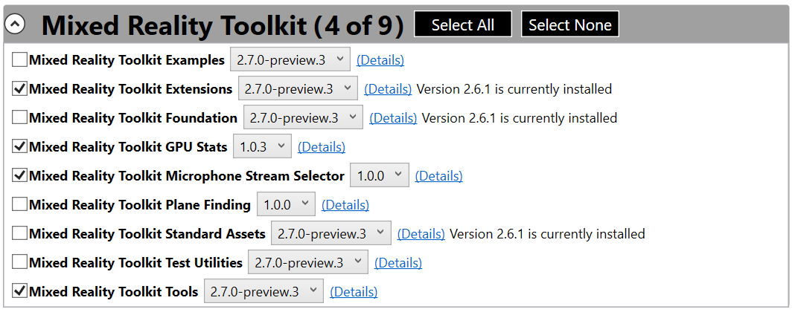

# Discovering and acquiring features

The sections in this article outline how to find feature packages in the Mixed Reality Feature Tool. Refer to the screenshot below if you need a reference for a given section:

## Available features

### Category

The Mixed Reality Feature Tool displays a collection of feature categories to make it easy to find what you want. Expand any of the categories to display its collection of available features.

> [!NOTE]
> If you can't find the functionality you're looking for, check **Other features**.

The category header in the above screenshot contains the following properties, from left to right:

- Expand and collapse button
- Category name (ex: Mixed Reality Toolkit)
- Count of selected features
- Count of available features
- Section buttons

> [!NOTE]
> The selection buttons are context sensitive. Based on the state of feature selection within the category, one or more of the `Select All` and `Select None` buttons will be displayed.

### Feature

Features are listed in their appropriate category. From left to right in the above screenshot, feature entries contain:

- Selection check box
- Feature name (ex: Mixed Reality Toolkit Foundation)
- List of available versions
- Link to the [feature package details](viewing-package-details.md)

> [!NOTE]
> If a feature is provided by an Early Access (also called private preview) program, an indicator icon  will be displayed.

## Refresh the feature catalog

To check for new and updated features, click the refresh  button. This will connect to the catalog site and retrieve the latest information. Once the catalog has been read, the date and time of the last update will be displayed.

## Select features

Features are selected by expanding a category, selecting a version, and clicking the check box:

To select every package within a category, a `Select All` button is provided. `Select None` will deselect all selected packages. 

Each category with one or more selected features will update to display the count.

## Acquiring features

Once you've chosen your features, select **Get features** to start downloading the selected feature package files.

> [!NOTE]
> By default, previously acquired feature package files won't be re-downloaded. To change this behavior please see [configuring the feature tool](configuring-feature-tool.md).

Once downloading is complete, the Mixed Reality Feature Tool will move to the [importing features](importing-features.md) step.

## Going back to the previous step

From **Discover features**, the Mixed Reality Feature Tool allows for navigating back to project selection. Select **Go back** to start again.

## See also

- [Welcome to the Mixed Reality Feature Tool](welcome-to-mr-feature-tool.md)
- [Configuring the feature tool](configuring-feature-tool.md)
- [Viewing feature package details](viewing-package-details.md)
- [Importing selected packages](importing-features.md)
