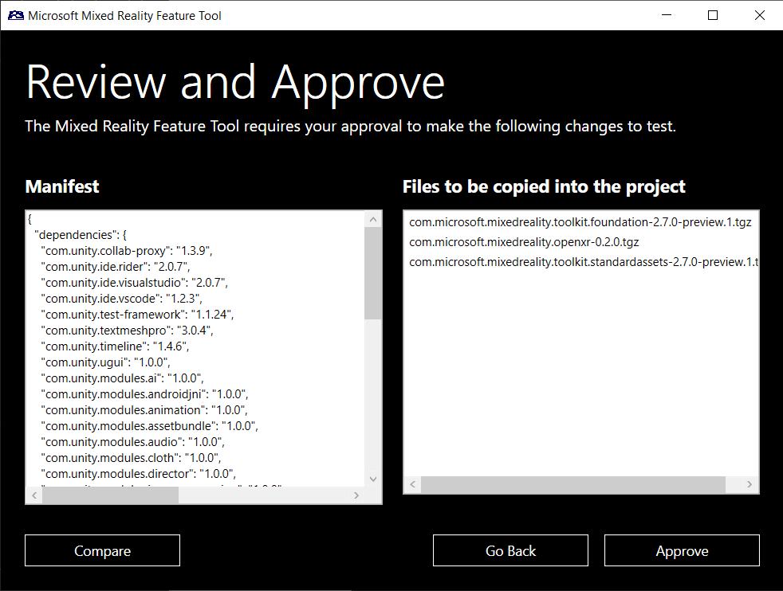

# [Unity 2019/2020 + Windows XR Plugin](#tab/winxr)

Once **MixedRealityFeatureTool** is opened click on start to get started with Mixed Reality Feature Tool.

Features are grouped by category to make things easier to find, click on **Mixed Reality Toolkit** dropdown to find packages relating to the Mixed Reality Toolkit.

check the **Mixed Reality Toolkit Foundation**, and click on the dropdown next to it to select the latest MRTK version, then click on **Get features** button to download the selected packages.

You also need to set the location of the target unity project to provide the **Project path**, click on the **Three dots** next to the Project path and browse to your project folder in the explorer for example _D:\MixedRealityLearning\MRTK Tutorials_.

> [!NOTE]
> The dialog that's displayed when browsing for the Unity project folder contains '_' as the file name. There must be a value for the file name to enable the folder to be selected.

Next click on the **Validate** button to validate the selected package, you will get a popup with message **No validation issues were detected** click on **OK** to close the popup and click on **Import** button.

Click on **Approve** Button to add the **Mixed Reality Toolkit** into the project.

# [Unity 2020 + OpenXR](#tab/openxr)
In the bottom left hand of the window, click on the gear symbol to open the settings menu.

Under **Feature Settings**, check the **Include preview releases** box and then click the **OK** button.

> [!NOTE]
>If you do not see an option to include preview releases, make sure you're using the latest version of the MR Feature Tool.

Now that your settings are configured, click on **Start** to get started with Mixed Reality Feature Tool.

Features are grouped by category to make things easier to find, click on **Mixed Reality Toolkit** dropdown to find packages relating to the Mixed Reality Toolkit.
Check the **Mixed Reality Toolkit Foundation**, and click on the dropdown next to it to select the required MRTK version, for this tutorial series please select the latest **2.7 preview package**.

Under the **Platform Support** dropdown, select **Mixed Reality OpenXR Plugin**. Make sure the latest version is selected in the dropdown.

Click on the **Get features** button to download the selected packages.

You also need to set the location of the target unity project to provide the **Project path**, click on the **Three dots** next to the Project path and browse to your project folder in the explorer for example _D:\MixedRealityLearning\MRTK Tutorials_.

> [!NOTE]
> The dialog that's displayed when browsing for the Unity project folder contains '_' as the file name. There must be a value for the file name to enable the folder to be selected.

Next click on the **Validate** button to validate the selected package, you will get a popup with message **No validation issues were detected** click on **OK** to close the popup and click on **Import** button.

Click on the **Approve** button to add the **Mixed Reality Toolkit** into the project.

# [Legacy WSA](#tab/wsa)
Once **MixedRealityFeatureTool** is opened click on start to get started with Mixed Reality Feature Tool.

Features are grouped by category to make things easier to find, click on **Mixed Reality Toolkit** dropdown to find packages relating to the Mixed Reality Toolkit.

check the **Mixed Reality Toolkit Foundation**, and click on the dropdown next to it to select the latest MRTK version, then click on **Get features** button to download the selected packages.

You also need to set the location of the target unity project to provide the **Project path**, click on the **Three dots** next to the Project path and browse to your project folder in the explorer for example _D:\MixedRealityLearning\MRTK Tutorials_.

> [!NOTE]
> The dialog that's displayed when browsing for the Unity project folder contains '_' as the file name. There must be a value for the file name to enable the folder to be selected.

Next click on the **Validate** button to validate the selected package, you will get a popup with message **No validation issues were detected** click on **OK** to close the popup and click on **Import** button.

Click on **Approve** Button to add the **Mixed Reality Toolkit** into the project.

