# MR and Azure 311 - Microsoft Graph

>[!NOTE]
>The Mixed Reality Academy tutorials were designed with HoloLens (1st gen) and Mixed Reality Immersive Headsets in mind.  As such, we feel it is important to leave these tutorials in place for developers who are still looking for guidance in developing for those devices.  These tutorials will **_not_** be updated with the latest toolsets or interactions being used for HoloLens 2.  They will be maintained to continue working on the supported devices. There will be a new series of tutorials that will be posted in the future that will demonstrate how to develop for HoloLens 2.  This notice will be updated with a link to those tutorials when they are posted.

In this course, you will learn how to use *Microsoft Graph* to log in into your Microsoft account using secure authentication within a mixed reality application. You will then retrieve and display your scheduled meetings in the application interface.


*Microsoft Graph* is a set of APIs designed to enable access to many of Microsoft's services. Microsoft describes Microsoft Graph as being a matrix of resources connected by relationships, meaning it allows an application to access all sorts of connected user data. For more information, visit the [Microsoft Graph page](https://developer.microsoft.com/graph).

Development will include the creation of an app where the user will be instructed to gaze at and then tap a sphere, which will prompt the user to log in safely to a Microsoft account. Once logged in to their account, the user will be able to see a list of meetings scheduled for the day.

Having completed this course, you will have a mixed reality HoloLens application, which will be able to do the following:

1.	Using the Tap gesture, tap on an object, which will prompt the user to log into a Microsoft Account (moving out of the app to log in, and then back into the app again).
2.	View a list of meetings scheduled for the day. 

In your application, it is up to you as to how you will integrate the results with your design. This course is designed to teach you how to integrate an Azure Service with your Unity project. It is your job to use the knowledge you gain from this course to enhance your mixed reality application.

## Device support

<table>
<tr>
<th>Course</th><th style="width:150px"> <a href="/hololens/hololens1-hardware">HoloLens</a></th><th style="width:150px"> <a href="../../../discover/immersive-headset-hardware-details.md">Immersive headsets</a></th>
</tr><tr>
<td> MR and Azure 311: Microsoft Graph</td><td style="text-align: center;"> ✔️</td><td style="text-align: center;"> </td>
</tr>
</table>

## Prerequisites

> [!NOTE]
> This tutorial is designed for developers who have basic experience with Unity and C#. Please also be aware that the prerequisites and written instructions within this document represent what has been tested and verified at the time of writing (July 2018). You are free to use the latest software, as listed within the [install the tools](../../install-the-tools.md) article, though it should not be assumed that the information in this course will perfectly match what you will find in newer software than what is listed below.

We recommend the following hardware and software for this course:

- A development PC
- [Windows 10 Fall Creators Update (or later) with Developer mode enabled](../../install-the-tools.md#installation-checklist)
- [The latest Windows 10 SDK](../../install-the-tools.md#installation-checklist)
- [Unity 2017.4](../../install-the-tools.md#installation-checklist)
- [Visual Studio 2017](../../install-the-tools.md#installation-checklist)
- A [Microsoft HoloLens](/hololens/hololens1-hardware) with Developer mode enabled
- Internet access for Azure setup and Microsoft Graph data retrieval
- A valid **Microsoft Account** (either personal or work/school)
- A few meetings scheduled for the current day, using the same Microsoft Account

### Before you start

1.	To avoid encountering issues building this project, it is strongly suggested that you create the project mentioned in this tutorial in a root or near-root folder (long folder paths can cause issues at build-time).
2.	Set up and test your HoloLens. If you need support setting up your HoloLens, [make sure to visit the HoloLens setup article](/hololens/hololens-setup). 
3.	It is a good idea to perform Calibration and Sensor Tuning when beginning developing a new HoloLens App (sometimes it can help to perform those tasks for each user). 

For help on Calibration, please follow this [link to the HoloLens Calibration article](/hololens/hololens-calibration#hololens-2).

For help on Sensor Tuning, please follow this [link to the HoloLens Sensor Tuning article](/hololens/hololens-updates).

## Chapter 1 - Create your app in the Application Registration Portal

To begin with, you will need to create and register your application in the **Application Registration Portal**.

In this Chapter you will also find the Service Key that will allow you to make calls to *Microsoft Graph* to access your account content.

1.  Navigate to the [Microsoft Application Registration Portal](https://apps.dev.microsoft.com) and login with your Microsoft Account. Once you have logged in, you will be redirected to the **Application Registration Portal**.

2.  In the **My applications** section, click on the button **Add an app**.

    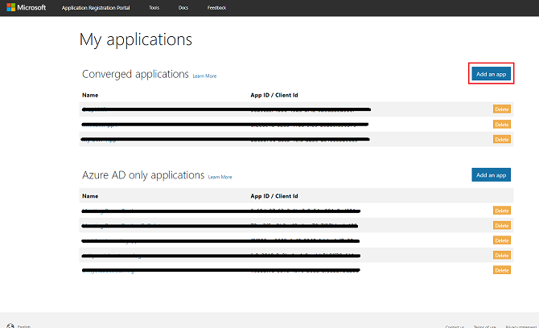

    > [!IMPORTANT]
    > The **Application Registration Portal** can look different, depending on whether you have previously worked with *Microsoft Graph*. The below screenshots display these different versions.

3.  Add a name for your application and click **Create**.

    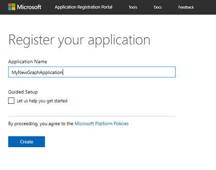

4.  Once the application has been created, you will be redirected to the application main page. Copy the **Application Id** and make sure to note this value somewhere safe, you will use it soon in your code.

    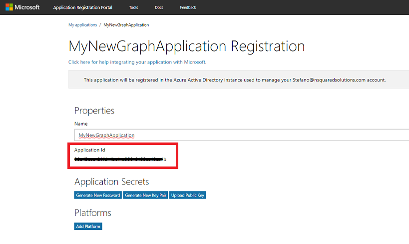

5.  In the **Platforms** section, make sure **Native Application** is displayed. If *not* click on **Add Platform** and select **Native Application**.

    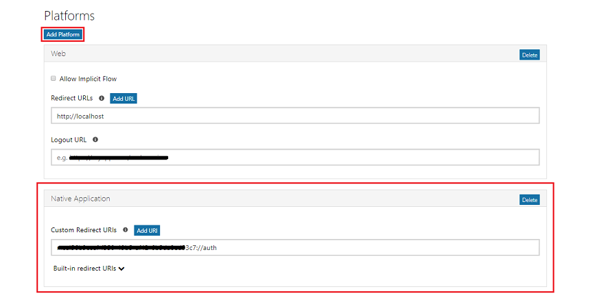

6.  Scroll down in the same page and in the section called **Microsoft Graph Permissions** you will need to add additional permissions for the application. Click on **Add** next to **Delegated Permissions**.

    

7.  Since you want your application to access the user's Calendar, check the box called **Calendars.Read** and click **OK**.

    

8.  Scroll to the bottom and click the **Save** button.

    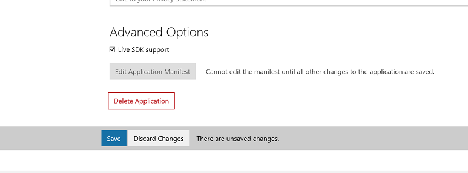

9.  Your save will be confirmed, and you can log out from the **Application Registration Portal**.

## Chapter 2 - Set up the Unity project

The following is a typical set up for developing with mixed reality, and as such, is a good template for other projects.

1.  Open *Unity* and click **New**.

    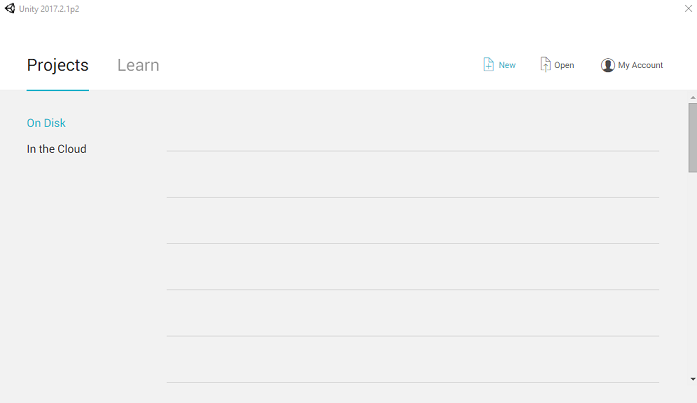

2.  You need to provide a Unity project name. Insert **MSGraphMR**. Make sure the project template is set to **3D**. Set the **Location** to somewhere appropriate for you (remember, closer to root directories is better). Then, click **Create project**.

    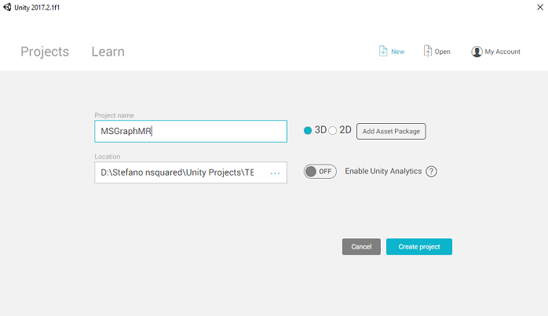

3.	With Unity open, it is worth checking the default **Script Editor** is set to **Visual Studio**. Go to **Edit** > **Preferences** and then from the new window, navigate to **External Tools**. Change **External Script Editor** to **Visual Studio 2017**. Close the **Preferences** window.

    

4.  Go to **File** > **Build Settings** and select **Universal Windows Platform**, then click on the **Switch Platform** button to apply your selection.

    

5.	While still in **File** > **Build Settings**, make sure that:

    1. **Target Device** is set to **HoloLens**
    2. **Build Type** is set to **D3D**
    3. **SDK** is set to **Latest installed**
    4. **Visual Studio Version** is set to **Latest installed**
    5. **Build and Run** is set to **Local Machine**
    6. Save the scene and add it to the build.

        1. Do this by selecting **Add Open Scenes**. A save window will appear.

            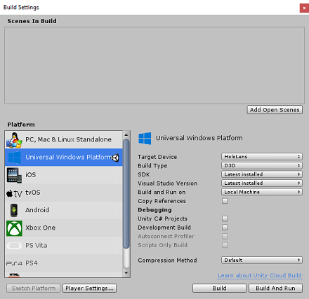

        2. Create a new folder for this, and any future, scene. Select the **New folder** button, to create a new folder, name it **Scenes**.

            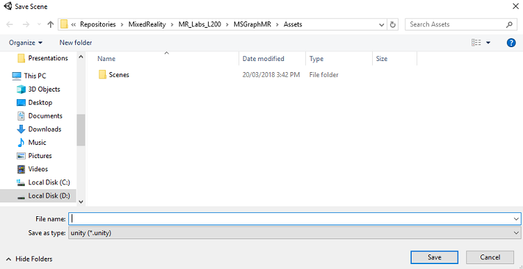

        3. Open your newly created **Scenes** folder, and then in the *File name*: text field, type **MR_ComputerVisionScene**, then click **Save**.

            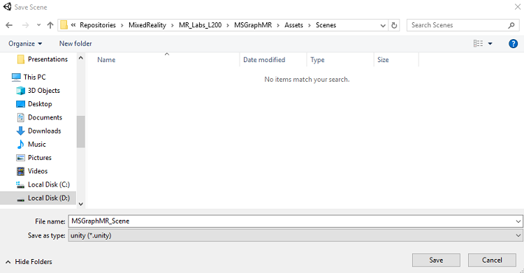

            > [!IMPORTANT] 
            > Be aware, you must save your Unity scenes within the *Assets* folder, as they must be associated with the Unity project. Creating the scenes folder (and other similar folders) is a typical way of structuring a Unity project.

    7.  The remaining settings, in *Build Settings*, should be left as default for now.

6.  In the *Build Settings* window, click on the **Player Settings** button, this will open the related panel in the space where the *Inspector* is located. 

    

7. In this panel, a few settings need to be verified:

    1. In the **Other Settings** tab:

        1.  **Scripting** **Runtime Version** should be **Experimental** (.NET 4.6 Equivalent), which will trigger a need to restart the Editor.

        2. **Scripting Backend** should be **.NET**

        3. **API Compatibility Level** should be **.NET 4.6**

            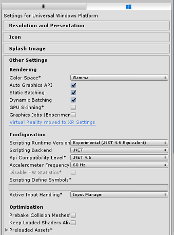

    2.  Within the **Publishing Settings** tab, under **Capabilities**, check:

        - **InternetClient**

            

    3.  Further down the panel, in **XR Settings** (found below **Publish Settings**), check **Virtual Reality Supported**, make sure the **Windows Mixed Reality SDK** is added.

        

8.  Back in *Build Settings*, *Unity C# Projects* is no longer greyed out; check the checkbox next to this.

9.  Close the *Build Settings* window.

10.  Save your scene and project (**FILE** > **SAVE SCENES / FILE** > **SAVE PROJECT**).

## Chapter 3 - Import Libraries in Unity

> [!IMPORTANT]
> If you wish to skip the *Unity Set up* component of this course, and continue straight into code, feel free to download this [Azure-MR-311.unitypackage](https://github.com/Microsoft/HolographicAcademy/raw/Azure-MixedReality-Labs/Azure%20Mixed%20Reality%20Labs/MR%20and%20Azure%20311%20-%20Microsoft%20Graph/Azure-MR-311.unitypackage), import it into your project as a [**Custom Package**](https://docs.unity3d.com/Manual/AssetPackages.html), and then continue from [Chapter 5](#chapter-5---create-meetingsui-class).

To use *Microsoft Graph* within Unity you need to make use of the  **Microsoft.Identity.Client** DLL. It is possible to use the Microsoft Graph SDK, however, it will require the addition of a NuGet package after you build the Unity project (meaning editing the project post-build). It is considered simpler to import the required DLLs directly into Unity.

> [!NOTE]
> There is currently a known issue in Unity which requires plugins to be reconfigured after import. These steps (4 - 7 in this section) will no longer be required after the bug has been resolved.

To import *Microsoft Graph* into your own project, [download the MSGraph_LabPlugins.zip file](https://github.com/Microsoft/HolographicAcademy/raw/Azure-MixedReality-Labs/Azure%20Mixed%20Reality%20Labs/MR%20and%20Azure%20311%20-%20Microsoft%20Graph/MSGraph_LabPlugins.unitypackage). This package has been created with versions of the libraries that have been tested.

If you wish to know more about how to add custom DLLs to your Unity project, [follow this link](https://docs.unity3d.com/Manual/UsingDLL.html).

To import the package:

1.  Add the Unity Package to Unity by using the **Assets** > **Import Package** > **Custom Package** menu option. Select the package you just downloaded.

2.  In the **Import Unity Package** box that pops up, ensure everything under (and including) **Plugins** is selected.

    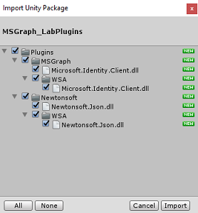

3.  Click the **Import** button to add the items to your project.

4.  Go to the **MSGraph** folder under **Plugins** in the *Project Panel* and select the plugin called **Microsoft.Identity.Client**.

    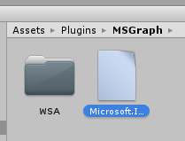

5.  With the *plugin* selected, ensure that **Any Platform** is unchecked, then ensure that **WSAPlayer** is also unchecked, then click **Apply**. This is just to confirm that the files are configured correctly.

    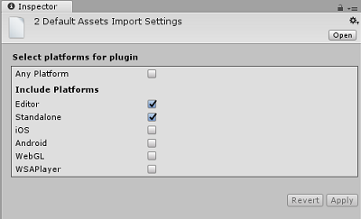

    > [!NOTE] 
    > Marking these plugins configures them to only be used in the Unity Editor. There are a different set of DLLs in the WSA folder which will be used after the project is exported from Unity as a Universal Windows Application.

6.  Next, you need to open the **WSA** folder, within the **MSGraph** folder. You will see a copy of the same file you just configured. Select the file, and then in the inspector:

    -   ensure that **Any Platform** is **unchecked**, and that **only** **WSAPlayer** is **checked**.

    -   Ensure **SDK** is set to **UWP**, and **Scripting Backend** is set to **Dot Net**

    -   Ensure that **Don't process** is **checked**.

        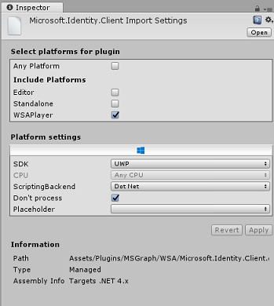

7.  Click **Apply**.

## Chapter 4 - Camera Setup

During this Chapter you will set up the Main Camera of your scene:

1.  In the *Hierarchy Panel*, select the **Main Camera**.

2.  Once selected, you will be able to see all the components of the **Main Camera** in the *Inspector* panel.

    1.  The **Camera object** must be named **Main Camera** (note the spelling!)

    2.  The Main Camera **Tag** must be set to **MainCamera** (note the spelling!)

    3.  Make sure the **Transform Position** is set to **0, 0, 0**

    4.  Set **Clear Flags** to **Solid Color**

    5.  Set the **Background Color** of the Camera Component to **Black, Alpha 0** **(Hex Code: #00000000)**

        

3.  The final object structure in the *Hierarchy Panel* should be like the one shown in the image below:

    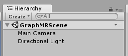

## Chapter 5 - Create MeetingsUI class

The first script you need to create is **MeetingsUI**, which is responsible for hosting and populating the UI of the application (welcome message, instructions and the meetings details).

To create this class:

1.  Right-click on the **Assets** folder in the *Project Panel*, then select **Create** > **Folder**. Name the folder **Scripts**.

    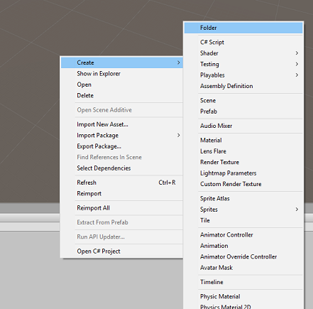
    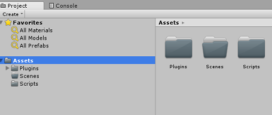

2.  Open the **Scripts** folder then, within that folder, right-click, **Create** > **C# Script**. Name the script **MeetingsUI.**

    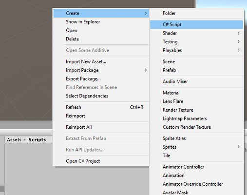

3.  Double-click on the new **MeetingsUI** script to open it with *Visual Studio*.

4.  Insert the following namespaces:

    ```csharp
    using System;
    using UnityEngine;
    ```

5.  Inside the class insert the following variables:

    ```csharp    
        /// <summary>
        /// Allows this class to behave like a singleton
        /// </summary>
        public static MeetingsUI Instance;

        /// <summary>
        /// The 3D text of the scene
        /// </summary>
        private TextMesh _meetingDisplayTextMesh;
    ```

6.  Then replace the **Start()** method and add an **Awake()** method. These will be called when the class initializes:

    ```csharp    
        /// <summary>
        /// Called on initialization
        /// </summary>
        void Awake()
        {
            Instance = this;
        }

        /// <summary>
        /// Called on initialization, after Awake
        /// </summary>
        void Start ()
        {
            // Creating the text mesh within the scene
            _meetingDisplayTextMesh = CreateMeetingsDisplay();
        }
    ```

7.  Add the methods responsible for creating the *Meetings UI* and populate it with the current meetings when requested:

    ```csharp    
        /// <summary>
        /// Set the welcome message for the user
        /// </summary>
        internal void WelcomeUser(string userName)
        {
            if(!string.IsNullOrEmpty(userName))
            {
                _meetingDisplayTextMesh.text = $"Welcome {userName}";
            }
            else 
            {
                _meetingDisplayTextMesh.text = "Welcome";
            }
        }

        /// <summary>
        /// Set up the parameters for the UI text
        /// </summary>
        /// <returns>Returns the 3D text in the scene</returns>
        private TextMesh CreateMeetingsDisplay()
        {
            GameObject display = new GameObject();
            display.transform.localScale = new Vector3(0.03f, 0.03f, 0.03f);
            display.transform.position = new Vector3(-3.5f, 2f, 9f);
            TextMesh textMesh = display.AddComponent<TextMesh>();
            textMesh.anchor = TextAnchor.MiddleLeft;
            textMesh.alignment = TextAlignment.Left;
            textMesh.fontSize = 80;
            textMesh.text = "Welcome! \nPlease gaze at the button" +
                "\nand use the Tap Gesture to display your meetings";

            return textMesh;
        }

        /// <summary>
        /// Adds a new Meeting in the UI by chaining the existing UI text
        /// </summary>
        internal void AddMeeting(string subject, DateTime dateTime, string location)
        {
            string newText = $"\n{_meetingDisplayTextMesh.text}\n\n Meeting,\nSubject: {subject},\nToday at {dateTime},\nLocation: {location}";

            _meetingDisplayTextMesh.text = newText;
        }
    ```

8. **Delete** the **Update()** method, and **save your changes** in Visual Studio before returning to Unity. 

## Chapter 6 - Create the Graph class

The next script to create is the **Graph** script. This script is responsible for making the calls to authenticate the user and retrieve the scheduled meetings for the current day from the user's calendar.

To create this class:

1.  Double-click on the **Scripts** folder, to open it.

2.  Right-click inside the **Scripts** folder, click **Create** > **C# Script**. Name the script **Graph**.

3.  Double-click on the script to open it with Visual Studio.

4.  Insert the following namespaces:

    ```csharp
    using System.Collections.Generic;
    using UnityEngine;
    using Microsoft.Identity.Client;
    using System;
    using System.Threading.Tasks;
    
    #if !UNITY_EDITOR && UNITY_WSA
    using System.Net.Http;
    using System.Net.Http.Headers;
    using Windows.Storage;
    #endif
    ```

    > [!IMPORTANT]
    > You will notice that parts of the code in this script are wrapped around [Precompile Directives](https://docs.unity3d.com/Manual/PlatformDependentCompilation.html), this is to avoid issues with the libraries when building the Visual Studio Solution.

5.  Delete the **Start()** and **Update()** methods, as they will not be used.

6.  Outside the **Graph** class, insert the following objects, which are necessary to deserialize the JSON object representing the daily scheduled meetings:

    ```csharp
    /// <summary>
    /// The object hosting the scheduled meetings
    /// </summary>
    [Serializable]
    public class Rootobject
    {
        public List<Value> value;
    }

    [Serializable]
    public class Value
    {
        public string subject { get; set; }
        public StartTime start { get; set; }
        public Location location { get; set; }
    }

    [Serializable]
    public class StartTime
    {
        public string dateTime;

        private DateTime? _startDateTime;
        public DateTime StartDateTime
        {
            get
            {
                if (_startDateTime != null)
                    return _startDateTime.Value;
                DateTime dt;
                DateTime.TryParse(dateTime, out dt);
                _startDateTime = dt;
                return _startDateTime.Value;
            }
        }
    }

    [Serializable]
    public class Location
    {
        public string displayName { get; set; }
    }
    ```

7.  Inside the **Graph** class, add the following variables:

    ```csharp    
        /// <summary>
        /// Insert your Application Id here
        /// </summary>
        private string _appId = "-- Insert your Application Id here --";

        /// <summary>
        /// Application scopes, determine Microsoft Graph accessibility level to user account
        /// </summary>
        private IEnumerable<string> _scopes = new List<string>() { "User.Read", "Calendars.Read" };

        /// <summary>
        /// Microsoft Graph API, user reference
        /// </summary>
        private PublicClientApplication _client;

        /// <summary>
        /// Microsoft Graph API, authentication
        /// </summary>
        private AuthenticationResult _authResult;

    ```

    > [!NOTE]
    > Change the **appId** value to be the **App Id** that you have noted in **[Chapter 1](#chapter-1---create-your-app-in-the-application-registration-portal), step 4**. This value should be the same as that displayed in the **Application Registration Portal,** in your application registration page.

8.  Within the **Graph** class, add the methods **SignInAsync()** and **AquireTokenAsync()**, that will prompt the user to insert the log-in credentials.

    ```csharp
        /// <summary>
        /// Begin the Sign In process using Microsoft Graph Library
        /// </summary>
        internal async void SignInAsync()
        {
    #if !UNITY_EDITOR && UNITY_WSA
            // Set up Grap user settings, determine if needs auth
            ApplicationDataContainer localSettings = ApplicationData.Current.LocalSettings;
            string userId = localSettings.Values["UserId"] as string;
            _client = new PublicClientApplication(_appId);

            // Attempt authentication
            _authResult = await AcquireTokenAsync(_client, _scopes, userId);

            // If authentication is successful, retrieve the meetings
            if (!string.IsNullOrEmpty(_authResult.AccessToken))
            {
                // Once Auth as been completed, find the meetings for the day
                await ListMeetingsAsync(_authResult.AccessToken);
            }
    #endif
        }

        /// <summary>
        /// Attempt to retrieve the Access Token by either retrieving
        /// previously stored credentials or by prompting user to Login
        /// </summary>
        private async Task<AuthenticationResult> AcquireTokenAsync(
            IPublicClientApplication app, IEnumerable<string> scopes, string userId)
        {
            IUser user = !string.IsNullOrEmpty(userId) ? app.GetUser(userId) : null;
            string userName = user != null ? user.Name : "null";

            // Once the User name is found, display it as a welcome message
            MeetingsUI.Instance.WelcomeUser(userName);

            // Attempt to Log In the user with a pre-stored token. Only happens
            // in case the user Logged In with this app on this device previously
            try
            {
                _authResult = await app.AcquireTokenSilentAsync(scopes, user);
            }
            catch (MsalUiRequiredException)
            {
                // Pre-stored token not found, prompt the user to log-in 
                try
                {
                    _authResult = await app.AcquireTokenAsync(scopes);
                }
                catch (MsalException msalex)
                {
                    Debug.Log($"Error Acquiring Token: {msalex.Message}");
                    return _authResult;
                }
            }
            
            MeetingsUI.Instance.WelcomeUser(_authResult.User.Name);

    #if !UNITY_EDITOR && UNITY_WSA
            ApplicationData.Current.LocalSettings.Values["UserId"] = 
            _authResult.User.Identifier;
    #endif
            return _authResult;
        }
    ```

9.  Add the following two methods:

    1.  **BuildTodayCalendarEndpoint()**, which builds the URI specifying the day, and time span, in which the scheduled meetings are retrieved.

    2.  **ListMeetingsAsync()**, which requests the scheduled meetings from *Microsoft Graph*.

    ```csharp
        /// <summary>
        /// Build the endpoint to retrieve the meetings for the current day.
        /// </summary>
        /// <returns>Returns the Calendar Endpoint</returns>
        public string BuildTodayCalendarEndpoint()
        {
            DateTime startOfTheDay = DateTime.Today.AddDays(0);
            DateTime endOfTheDay = DateTime.Today.AddDays(1);
            DateTime startOfTheDayUTC = startOfTheDay.ToUniversalTime();
            DateTime endOfTheDayUTC = endOfTheDay.ToUniversalTime();

            string todayDate = startOfTheDayUTC.ToString("o");
            string tomorrowDate = endOfTheDayUTC.ToString("o");
            string todayCalendarEndpoint = string.Format(
                "https://graph.microsoft.com/v1.0/me/calendarview?startdatetime={0}&enddatetime={1}",
                todayDate,
                tomorrowDate);

            return todayCalendarEndpoint;
        }

        /// <summary>
        /// Request all the scheduled meetings for the current day.
        /// </summary>
        private async Task ListMeetingsAsync(string accessToken)
        {
    #if !UNITY_EDITOR && UNITY_WSA
            var http = new HttpClient();

            http.DefaultRequestHeaders.Authorization = 
            new AuthenticationHeaderValue("Bearer", accessToken);
            var response = await http.GetAsync(BuildTodayCalendarEndpoint());

            var jsonResponse = await response.Content.ReadAsStringAsync();

            Rootobject rootObject = new Rootobject();
            try
            {
                // Parse the JSON response.
                rootObject = JsonUtility.FromJson<Rootobject>(jsonResponse);

                // Sort the meeting list by starting time.
                rootObject.value.Sort((x, y) => DateTime.Compare(x.start.StartDateTime, y.start.StartDateTime));

                // Populate the UI with the meetings.
                for (int i = 0; i < rootObject.value.Count; i++)
                {
                    MeetingsUI.Instance.AddMeeting(rootObject.value[i].subject,
                                                rootObject.value[i].start.StartDateTime.ToLocalTime(),
                                                rootObject.value[i].location.displayName);
                }
            }
            catch (Exception ex)
            {
                Debug.Log($"Error = {ex.Message}");
                return;
            }
    #endif
        }
    ```

10. You have now completed the **Graph** script. **Save your changes** in Visual Studio before returning to Unity.

## Chapter 7 - Create the GazeInput script

You will now create the **GazeInput**. This class handles and keeps track of the user's gaze, using a **Raycast** coming from the **Main Camera**, projecting forward.

To create the script:

1.  Double-click on the **Scripts** folder, to open it.

2.  Right-click inside the **Scripts** folder, click **Create** > **C# Script**. Name the script **GazeInput**.

3.  Double-click on the script to open it with Visual Studio.

4.  Change the namespaces code to match the one below, along with adding the '**\[System.Serializable\]**' tag above your **GazeInput** class, so that it can be serialized:

    ```csharp
    using UnityEngine;

    /// <summary>
    /// Class responsible for the User's Gaze interactions
    /// </summary>
    [System.Serializable]
    public class GazeInput : MonoBehaviour
    {
    ```

5.  Inside the **GazeInput** class, add the following variables:

    ```csharp    
        [Tooltip("Used to compare whether an object is to be interacted with.")]
        internal string InteractibleTag = "SignInButton";

        /// <summary>
        /// Length of the gaze
        /// </summary>
        internal float GazeMaxDistance = 300;

        /// <summary>
        /// Object currently gazed
        /// </summary>
        internal GameObject FocusedObject { get; private set; }

        internal GameObject oldFocusedObject { get; private set; }

        internal RaycastHit HitInfo { get; private set; }

        /// <summary>
        /// Cursor object visible in the scene
        /// </summary>
        internal GameObject Cursor { get; private set; }

        internal bool Hit { get; private set; }

        internal Vector3 Position { get; private set; }

        internal Vector3 Normal { get; private set; }

        private Vector3 _gazeOrigin;

        private Vector3 _gazeDirection;
    ```

6.  Add the **CreateCursor()** method to create the HoloLens cursor in the scene, and call the method from the **Start()** method:

    ```csharp    
        /// <summary>
        /// Start method used upon initialisation.
        /// </summary>
        internal virtual void Start()
        {
            FocusedObject = null;
            Cursor = CreateCursor();
        }

        /// <summary>
        /// Method to create a cursor object.
        /// </summary>
        internal GameObject CreateCursor()
        {
            GameObject newCursor = GameObject.CreatePrimitive(PrimitiveType.Sphere);
            newCursor.SetActive(false);
            // Remove the collider, so it doesn't block raycast.
            Destroy(newCursor.GetComponent<SphereCollider>());
            newCursor.transform.localScale = new Vector3(0.05f, 0.05f, 0.05f);
            Material mat = new Material(Shader.Find("Diffuse"));
            newCursor.GetComponent<MeshRenderer>().material = mat;
            mat.color = Color.HSVToRGB(0.0223f, 0.7922f, 1.000f);
            newCursor.SetActive(true);

            return newCursor;
        }
    ```

7.  The following methods enable the gaze Raycast and keep track of the focused objects.

    ```csharp
    /// <summary>
    /// Called every frame
    /// </summary>
    internal virtual void Update()
    {
        _gazeOrigin = Camera.main.transform.position;

        _gazeDirection = Camera.main.transform.forward;

        UpdateRaycast();
    }
    /// <summary>
    /// Reset the old focused object, stop the gaze timer, and send data if it
    /// is greater than one.
    /// </summary>
    private void ResetFocusedObject()
    {
        // Ensure the old focused object is not null.
        if (oldFocusedObject != null)
        {
            if (oldFocusedObject.CompareTag(InteractibleTag))
            {
                // Provide the 'Gaze Exited' event.
                oldFocusedObject.SendMessage("OnGazeExited", SendMessageOptions.DontRequireReceiver);
            }
        }
    }
    ```

    ```csharp
        private void UpdateRaycast()
        {
            // Set the old focused gameobject.
            oldFocusedObject = FocusedObject;
            RaycastHit hitInfo;

            // Initialise Raycasting.
            Hit = Physics.Raycast(_gazeOrigin,
                _gazeDirection,
                out hitInfo,
                GazeMaxDistance);
                HitInfo = hitInfo;

            // Check whether raycast has hit.
            if (Hit == true)
            {
                Position = hitInfo.point;
                Normal = hitInfo.normal;

                // Check whether the hit has a collider.
                if (hitInfo.collider != null)
                {
                    // Set the focused object with what the user just looked at.
                    FocusedObject = hitInfo.collider.gameObject;
                }
                else
                {
                    // Object looked on is not valid, set focused gameobject to null.
                    FocusedObject = null;
                }
            }
            else
            {
                // No object looked upon, set focused gameobject to null.
                FocusedObject = null;

                // Provide default position for cursor.
                Position = _gazeOrigin + (_gazeDirection * GazeMaxDistance);

                // Provide a default normal.
                Normal = _gazeDirection;
            }

            // Lerp the cursor to the given position, which helps to stabilize the gaze.
            Cursor.transform.position = Vector3.Lerp(Cursor.transform.position, Position, 0.6f);

            // Check whether the previous focused object is this same. If so, reset the focused object.
            if (FocusedObject != oldFocusedObject)
            {
                ResetFocusedObject();
                if (FocusedObject != null)
                {
                    if (FocusedObject.CompareTag(InteractibleTag))
                    {
                        // Provide the 'Gaze Entered' event.
                        FocusedObject.SendMessage("OnGazeEntered", 
                            SendMessageOptions.DontRequireReceiver);
                    }
                }
            }
        }
    ```

8.  **Save your changes** in Visual Studio before returning to Unity.

## Chapter 8 - Create the Interactions class

You will now need to create the **Interactions** script, which is responsible for:

-   Handling the **Tap** interaction and the **Camera Gaze**, which enables the user to interact with the log in "button" in the scene.

-   Creating the log in "button" object in the scene for the user to interact with.

To create the script:

1.  Double-click on the **Scripts** folder, to open it.

2.  Right-click inside the **Scripts** folder, click **Create** > **C# Script**. Name the script **Interactions**.

3.  Double-click on the script to open it with Visual Studio.

4.  Insert the following namespaces:

    ```csharp
    using UnityEngine;
    using UnityEngine.XR.WSA.Input;
    ```

5.  Change the inheritance of the **Interaction** class from *MonoBehaviour* to **GazeInput**.

    ~~public class Interactions : MonoBehaviour~~

    ```csharp
    public class Interactions : GazeInput
    ```

6.  Inside the **Interaction** class insert the following variable:

    ```csharp
        /// <summary>
        /// Allows input recognition with the HoloLens
        /// </summary>
        private GestureRecognizer _gestureRecognizer;
    ```

7.  Replace the **Start** method; notice it is an override method, which calls the 'base' Gaze class method. **Start()** will be called when the class initializes, registering for input recognition and creating the sign in *button* in the scene:

    ```csharp    
        /// <summary>
        /// Called on initialization, after Awake
        /// </summary>
        internal override void Start()
        {
            base.Start();

            // Register the application to recognize HoloLens user inputs
            _gestureRecognizer = new GestureRecognizer();
            _gestureRecognizer.SetRecognizableGestures(GestureSettings.Tap);
            _gestureRecognizer.Tapped += GestureRecognizer_Tapped;
            _gestureRecognizer.StartCapturingGestures();

            // Add the Graph script to this object
            gameObject.AddComponent<MeetingsUI>();
            CreateSignInButton();
        }
    ```

8.  Add the **CreateSignInButton()** method, which will instantiate the sign in *button* in the scene and set its properties:

    ```csharp    
        /// <summary>
        /// Create the sign in button object in the scene
        /// and sets its properties
        /// </summary>
        void CreateSignInButton()
        {
            GameObject signInButton = GameObject.CreatePrimitive(PrimitiveType.Sphere);

            Material mat = new Material(Shader.Find("Diffuse"));
            signInButton.GetComponent<Renderer>().material = mat;
            mat.color = Color.blue;

            signInButton.transform.position = new Vector3(3.5f, 2f, 9f);
            signInButton.tag = "SignInButton";
            signInButton.AddComponent<Graph>();
        }
    ```

9.  Add the **GestureRecognizer_Tapped()** method, which be respond for the *Tap* user event.

    ```csharp   
        /// <summary>
        /// Detects the User Tap Input
        /// </summary>
        private void GestureRecognizer_Tapped(TappedEventArgs obj)
        {
            if(base.FocusedObject != null)
            {
                Debug.Log($"TAP on {base.FocusedObject.name}");
                base.FocusedObject.SendMessage("SignInAsync", SendMessageOptions.RequireReceiver);
            }
        }
    ```

10. **Delete** the **Update()** method, and then **save your changes** in Visual Studio before returning to Unity.

## Chapter 9 - Set up the script references

In this Chapter you need to place the **Interactions** script onto the **Main Camera**. That script will then handle placing the other scripts where they need to be.

-  From the **Scripts** folder in the *Project Panel*, drag the script **Interactions** to the **Main Camera** object, as pictured below.

    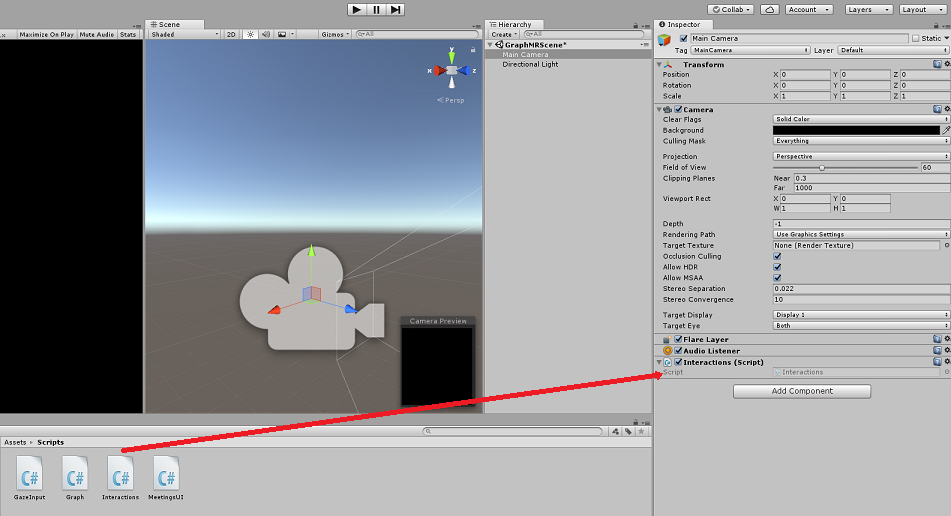

## Chapter 10 - Setting up the Tag

The code handling the gaze will make use of the Tag **SignInButton** to identify which object the user will interact with to sign-in to *Microsoft Graph*.

To create the Tag:

1.  In the Unity Editor click on the **Main Camera** in the *Hierarchy Panel*.

2.  In the *Inspector Panel* click on the **MainCamera** *Tag* to open a drop-down list. Click on **Add Tag...**

    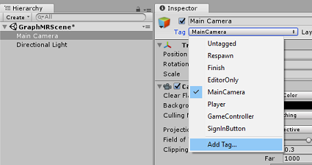

3.  Click on the **+** button.

    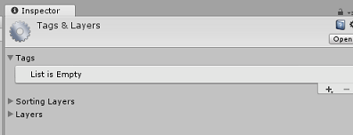

4.  Write the Tag name as **SignInButton** and click Save.

    

## Chapter 11 - Build the Unity project to UWP

Everything needed for the Unity section of this project has now been completed, so it is time to build it from Unity.

1.  Navigate to *Build Settings* (**File* > *Build Settings**).

    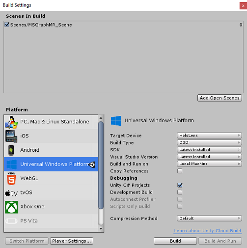

2.  If not already, tick **Unity C\# Projects**.

3.  Click **Build**. Unity will launch a **File Explorer** window, where you need to create and then select a folder to build the app into. Create that folder now, and name it **App**. Then with the **App** folder selected, click **Select Folder**.

4.  Unity will begin building your project to the **App** folder.

5.  Once Unity has finished building (it might take some time), it will open a **File Explorer** window at the location of your build (check your task bar, as it may not always appear above your windows, but will notify you of the addition of a new window).

## Chapter 12 - Deploy to HoloLens

To deploy on HoloLens:

1.  You will need the IP Address of your HoloLens (for Remote Deploy), and to ensure your HoloLens is in **Developer Mode.** To do this:

    1.  Whilst wearing your HoloLens, open the **Settings**.

    2.  Go to **Network & Internet** > **Wi-Fi** > **Advanced Options**

    3.  Note the **IPv4** address.

    4.  Next, navigate back to **Settings**, and then to **Update & Security** > **For Developers**

    5.  Set **Developer Mode On**.

2.  Navigate to your new Unity build (the **App** folder) and open the solution file with **Visual Studio**.

3.  In the **Solution Configuration** select **Debug**.

4.  In the **Solution Platform**, select **x86, Remote Machine**. You will be prompted to insert the **IP address** of a remote device (the HoloLens, in this case, which you noted).

    

5.  Go to **Build** menu and click on **Deploy Solution** to sideload the application to your HoloLens.

6.  Your app should now appear in the list of installed apps on your HoloLens, ready to be launched!

## Your Microsoft Graph HoloLens application

Congratulations, you built a mixed reality app that leverages the Microsoft Graph, to read and display user Calendar data.


## Bonus exercises

### Exercise 1

Use Microsoft Graph to display other information about the user

-   User email / phone number / profile picture

### Exercise 1

Implement voice control to navigate the Microsoft Graph UI.