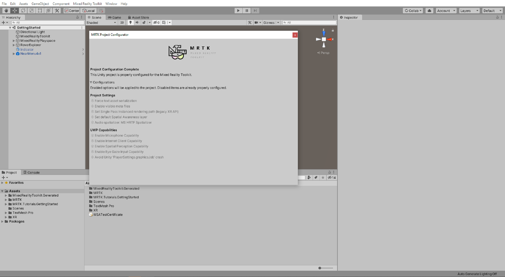
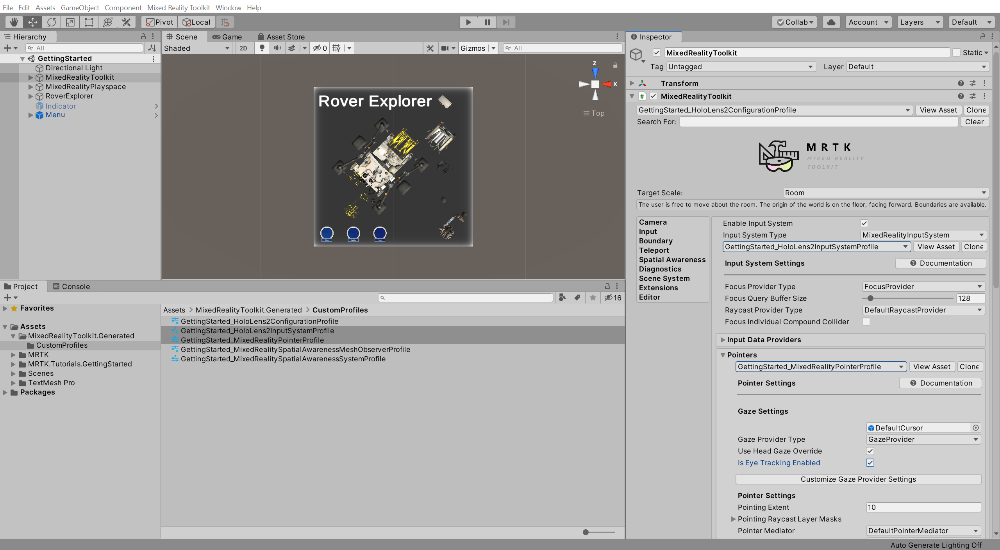
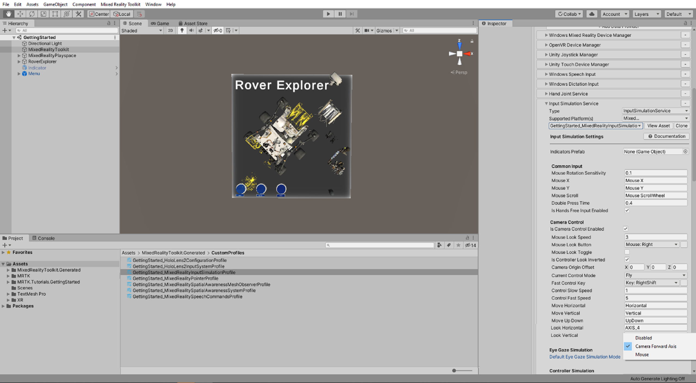
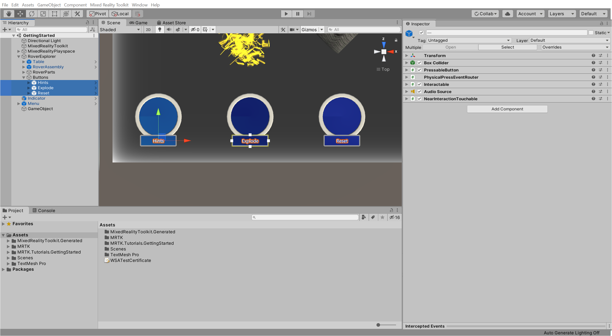
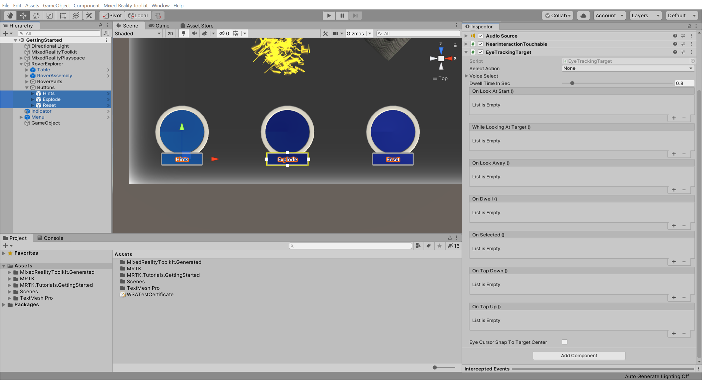
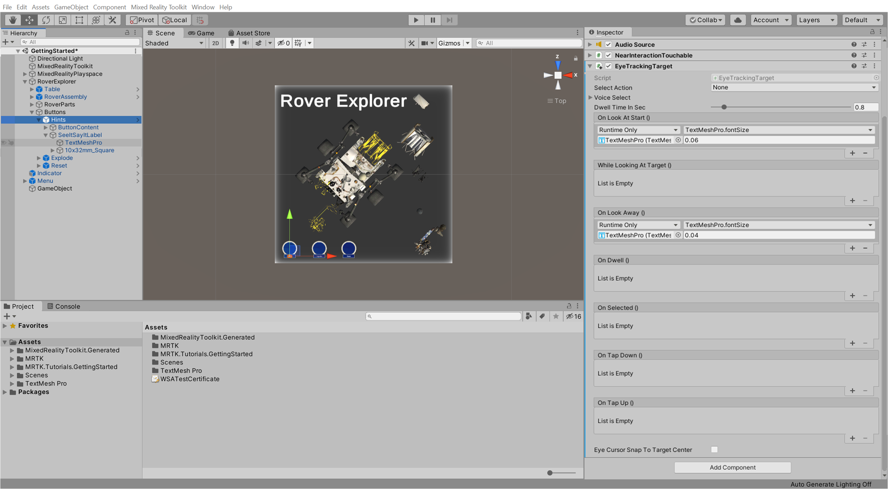
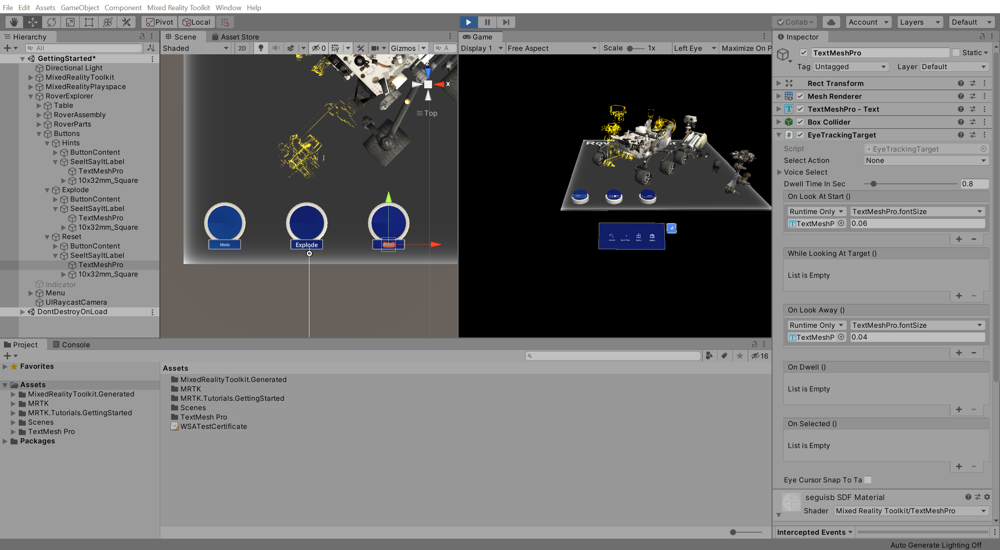

# 8. Using eye-tracking

In this tutorial, you will learn how to enable eye-tracking for HoloLens 2 and add eye-tracking to objects to trigger actions when the user looks at the objects.

> [!NOTE]
> If you are also deploying this project to HoloLens (1st generation), note that eye-tracking is only supported on HoloLens 2.

## Objectives

* Learn how to enable eye-tracking for HoleLens 2
* Learn how to use eye-tracking to trigger action

## Ensuring the Eye Gaze Input capability is enabled

In the Unity menu, select Mixed Reality Toolkit > Utilities > **Configure Unity Project** to open the **MRTK Project Configurator** window, then in the **UWP Capabilities** section, verify that **Enable Eye Gaze Input Capability** is greyed out:

> [!NOTE]
> The Gaze Input capability should have been enabled during the [Apply the MRTK Project Configurator settings](mr-learning-base-02.md#selecting-mrtk-and-project-settings) instructions when you configured the Unity project at the beginning of this tutorial series. However, if it is not enabled, make sure you enable it now.

## Enabling eye based gaze in the gaze provider

In the Hierarchy window, select the **MixedRealityToolkit** object, then in the Inspector window, select the MixedRealityToolkit > **Input** tab and take the following steps:

* Clone the **DefaultHoloLens2InputSystemProfile** and give it a suitable name, for example, _GettingStarted_HoloLens2InputSystemProfile_
* Expand the **Pointers** section
* Clone the **DefaultMixedRealityPointerProfile** and give it a suitable name, for example, _GettingStarted_MixedRealityPointerProfile_
* Locate the **Gaze Settings** section and check the **Is Eye Tracking Enabled** checkbox

> [!TIP]
> For a reminder on how to clone MRTK profiles, you can refer to the [Configuring the MRTK profiles](mr-learning-base-03.md) instructions.

## Enabling simulated eye-tracking for the Unity editor

In the Hierarchy window, select the **MixedRealityToolkit** object, then in the Inspector window, navigate to the **Input** tab, then:

* Expand the **Input Data Providers** > **Input Simulation Service** section
* Clone the **DefaultMixedRealityInputSimulationProfile** and give it a suitable name, for example, _GettingStarted_MixedRealityInputSimulationProfile_
* Locate the **Eye Simulation** section and check the **Simulate Eye Position** checkbox

## Adding eye-tracking to objects

In the Hierarchy window, expand the RoverExplorer > **Buttons** object, then for each of the three child button objects, expand and select the SeeItSayItLabel > **TextMeshPro** object:

With the three TextMeshPro objects still selected, in the Inspector window, use the **Add Component** button to add the following components to all the selected objects:

* **Box Collider** component
* **EyeTrackingTarget** component

In the Hierarchy window, select the **Hints** > SeeItSayItLabel > **TextMeshPro** object, then configure the **EyeTrackingTarget** component as follows:

* In the **On Look At Start ()** event section
  * Click the small **+** icon to add another event
  * Assign the object itself, i.e. the same **TextMeshPro** object, to the **None (Object)** field
  * From the **No Function** dropdown, select **TextMeshPro** > **float fontSize** to update this property value when the event is triggered
  * Set the argument to **0.06** to increase the current font size of 0.04 by 50%
* In the **On Look Away ()** event section
  * Click the small **+** icon to add another event
  * Assign the object itself, i.e. the same **TextMeshPro** object, to the **None (Object)** field
  * From the **No Function** dropdown, select **TextMeshPro** > **float fontSize** to update this property value when the event is triggered
  * Set the argument to **0.04** to reset the font size back to 0.04

**Repeat** this step for the **Explode** > SeeItSayItLabel > **TextMeshPro** object and the **Reset** > SeeItSayItLabel > **TextMeshPro** object.

If you now enter Game mode and then press-and-hold the right mouse button while moving your mouse until the gaze hit's one of the labels, you will see the font size increase by 50% and reset back to its original size when looking away:

## Congratulations

In this tutorial, you learned how to enable eye-tracking for HoloLens 2 and how to add eye-tracking to objects to trigger actions when the user looks at the objects.

> [!div class="nextstepaction"]
> [Next Tutorial: 9. Using speech commands](mr-learning-base-09.md)