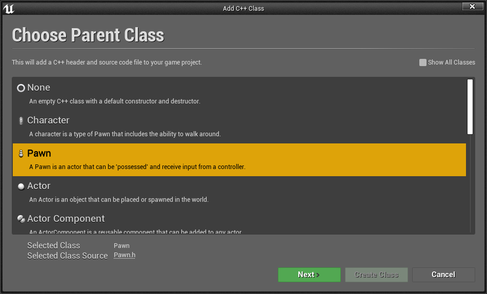
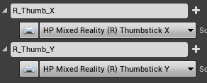
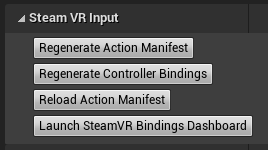

# [All platforms](#tab/all)

The same action and axis mappings in the game’s input project settings can be used from C++.

1. Create a new C++ Class with File/New C++ Class...


2. Create a pawn



3. In the project’s Visual Studio solution, find the new Pawn class and configure it for input.
* First, in the constructor, set AutoPossessPlayer to the first player to route input to the pawn.

```cpp
AMyPawn::AMyPawn()
{
    PrimaryActorTick.bCanEverTick = true;

    AutoPossessPlayer = EAutoReceiveInput::Player0;
}
```

* Then in SetupPlayerInputComponent, bind actions and axis events to the action names from the project’s input settings.

```cpp
void AMyPawn::SetupPlayerInputComponent(UInputComponent* PlayerInputComponent)
{
    Super::SetupPlayerInputComponent(PlayerInputComponent);

    PlayerInputComponent->BindAction("X_Button", IE_Pressed, this, &AMyPawn::XPressed);
    PlayerInputComponent->BindAction("L_GripAxis", this, &AMyPawn::LeftGripAxis);
}
```

* Add the callback functions to the class:

```cpp
void AMyPawn::XPressed()
{
    UE_LOG(LogTemp, Log, TEXT("X Pressed"));
}

void AMyPawn::LeftGripAxis(float AxisValue)
{
    if(AxisValue != 0.0f) 
    {
        UE_LOG(LogTemp, Log, TEXT("Left Grip Axis Valule: %f"), AxisValue);
    }
}
```

* Update the Pawn’s header with the callback function definitions:

```cpp
private:
    void XPressed();
    void LeftGripAxis(float AxisValue);
```

4. Compile from Visual Studio to launch the editor with the new pawn. Drag and drop the pawn from the content browser into the game and the pawn will now execute the callbacks when input is pressed.

# [SteamVR](#tab/steamvr)

When using thumbstick axis events, the name of the axis event must end in “_X” or “_Y” corresponding to the key used.



Finally, register the actions in the game with SteamVR by using the **Regenerate Action Manifest** and 
**Regenerate Controller Bindings** buttons in Project Settings > Steam VR Input.



