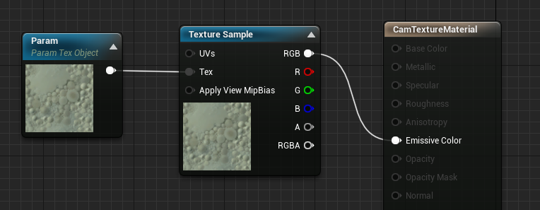
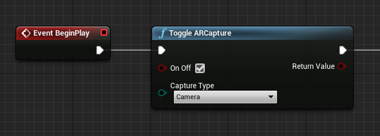
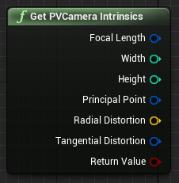
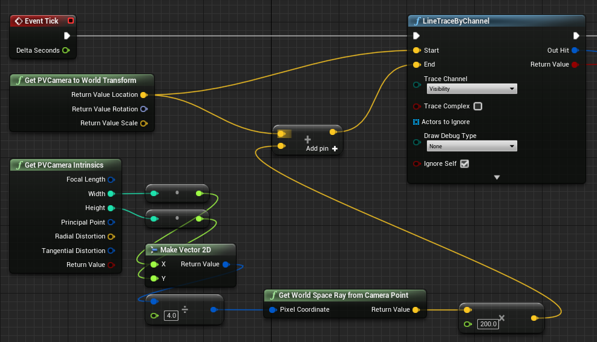
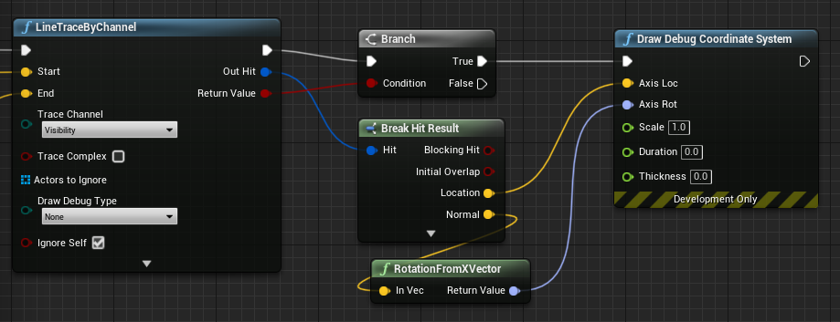

# [4.26](#tab/426) 

## PV Camera Feed Setup

> [!IMPORTANT]
> PV camera is implemented in both Windows Mixed Reality and OpenXR plugins. However OpenXR needs [Microsoft OpenXR plugin](https://github.com/microsoft/Microsoft-OpenXR-Unreal) to be installed. Also OpenXR has current limitation, camera can work with DirectX11 RHI. This limitation will be fixed in a further Unreal version. 

- In **Project Settings > HoloLens**, enable the **Webcam** capability:


- Create a new actor called “CamCapture” and add a plane to render the camera feed:


- Add the actor to your scene, create a new material called CamTextureMaterial with a Texture Object Parameter, and a texture sample.  Send the texture’s rgb data to the output emissive color:



## Rendering the PV Camera Feed

- In the CamCapture blueprint, turn on the PV Camera:



- Create a dynamic material instance from CamTextureMaterial and assign this material to the actor’s plane:


- Get the texture from the camera feed and assign it to the dynamic material if it's valid.  If the texture isn't valid, start a timer and try again after the timeout:


- Finally, scale the plane by the camera image’s aspect ratio:


## Find Camera Positions in World Space

The camera on the HoloLens 2 is offset vertically from the device’s head tracking.  A few functions exist to locate the camera in world space to account for the offset.

GetPVCameraToWorldTransform gets the transform in world space of the PV Camera and will be positioned on the camera lens:


GetWorldSpaceRayFromCameraPoint casts a ray from the camera lens into the scene in Unreal world space to find a pixel's content in the camera frame:


GetPVCameraIntrinsics returns the camera intrinsic values, which can be used when doing computer vision processing on a camera frame:



To find what exists in world space at a particular pixel coordinate, use a line trace with the world space ray:



Here we cast a 2-meter ray from the camera lens to the camera-space position ¼ from the top left of the frame.  Then use the hit result to render something where the object exists in world space:



When using spatial mapping, this hit position will match the surface that the camera is seeing.

## Rendering the PV Camera Feed in C++

- Create a new C++ actor called CamCapture
- In the project’s build.cs, add “AugmentedReality” to the PublicDependencyModuleNames list:

```cpp
PublicDependencyModuleNames.AddRange(
    new string[] {
        "Core",
        "CoreUObject",
        "Engine",
        "InputCore",
        "AugmentedReality"
});
```

- In CamCapture.h, include ARBlueprintLibrary.h

```cpp
#include "ARBlueprintLibrary.h"
```

- You also need to add local variables for the mesh and material:

```cpp
private:
    UStaticMesh* StaticMesh;
    UStaticMeshComponent* StaticMeshComponent;
    UMaterialInstanceDynamic* DynamicMaterial;
    bool IsTextureParamSet = false;
```

- In CamCapture.cpp, update the constructor to add a static mesh to the scene:

```cpp
ACamCapture::ACamCapture()
{
    PrimaryActorTick.bCanEverTick = true;

    // Load a mesh from the engine to render the camera feed to.
    StaticMesh = LoadObject<UStaticMesh>(nullptr, TEXT("/Engine/EngineMeshes/Cube.Cube"), nullptr, LOAD_None, nullptr);

    // Create a static mesh component to render the static mesh
    StaticMeshComponent = CreateDefaultSubobject<UStaticMeshComponent>(TEXT("CameraPlane"));
    StaticMeshComponent->SetStaticMesh(StaticMesh);

    // Scale and add to the scene
    StaticMeshComponent->SetWorldScale3D(FVector(0.1f, 1, 1));
    this->SetRootComponent(StaticMeshComponent);
}
```

In BeginPlay create a dynamic material instance from the project’s camera material, apply it to the static mesh component, and start the HoloLens camera. 
 
In the editor, right-click on the CamTextureMaterial in the content browser and select “Copy Reference” to get the string for CameraMatPath.

```cpp
void ACamCapture::BeginPlay()
{
    Super::BeginPlay();

    // Create a dynamic material instance from the game's camera material.
    // Right-click on a material in the project and select "Copy Reference" to get this string.
    FString CameraMatPath("Material'/Game/Materials/CamTextureMaterial.CamTextureMaterial'");
    UMaterial* BaseMaterial = (UMaterial*)StaticLoadObject(UMaterial::StaticClass(), nullptr, *CameraMatPath, nullptr, LOAD_None, nullptr);
    DynamicMaterial = UMaterialInstanceDynamic::Create(BaseMaterial, this);

    // Use the dynamic material instance when rendering the camera mesh.
    StaticMeshComponent->SetMaterial(0, DynamicMaterial);

    // Start the webcam.
    UARBlueprintLibrary::ToggleARCapture(true, EARCaptureType::Camera);
}
```

In Tick get the texture from the camera, set it to the texture parameter in the CamTextureMaterial material, and scale the static mesh component by the camera frame’s aspect ratio:

```cpp
void ACamCapture::Tick(float DeltaTime)
{
    Super::Tick(DeltaTime);

    // Dynamic material instance only needs to be set once.
    if(IsTextureParamSet)
    {
        return;
    }

    // Get the texture from the camera.
    UARTexture* ARTexture = UARBlueprintLibrary::GetARTexture(EARTextureType::CameraImage);
    if(ARTexture != nullptr)
    {
        // Set the shader's texture parameter (named "Param") to the camera image.
        DynamicMaterial->SetTextureParameterValue("Param", ARTexture);
        IsTextureParamSet = true;

        // Get the camera instrincs
        FARCameraIntrinsics Intrinsics;
        UARBlueprintLibrary::GetCameraIntrinsics(Intrinsics);

        // Scale the camera mesh by the aspect ratio.
        float R = (float)Intrinsics.ImageResolution.X / (float)Intrinsics.ImageResolution.Y;
        StaticMeshComponent->SetWorldScale3D(FVector(0.1f, R, 1));
    }
}
```

# [4.25](#tab/425)

## Render from the PV Camera for MRC

> [!NOTE]
> This requires **Unreal Engine 4.25** or newer.

The system and custom MRC recorders create mixed reality captures by combining the PV Camera with holograms rendered by the app.

By default, mixed reality capture uses the right eye's holographic output. If an immersive app chooses to [render from the PV Camera](../../platform-capabilities-and-apis/mixed-reality-capture-for-developers.md#render-from-the-pv-camera-opt-in), then that will be used instead. Rendering from the PV Camera improves the mapping between the real world and the holograms in the MRC video.

To opt in to rendering from the PV Camera:

1. Call **SetEnabledMixedRealityCamera** and **ResizeMixedRealityCamera**
    * Use the **Size X** and **Size Y** values to set the video dimensions.


Unreal will then handle requests from MRC to render from the PV Camera's perspective.

> [!NOTE]
> Only when [Mixed Reality Capture](/hololens/holographic-photos-and-videos) is triggered will the app be asked to render from the photo/video camera's perspective.

## Using the PV Camera

The webcam texture can be retrieved in the game at runtime, but it needs to be enabled in the editor's **Edit > Project Settings**:
1. Go to **Platforms > HoloLens > Capabilities** and check **Webcam**.
    * Use the **StartCameraCapture** function to use the webcam at runtime and the **StopCameraCapture** function to stop recording.


## Rendering an image
To render the camera image:
1. Create a dynamic material instance based on a material in the project, which is named **PVCamMat** in the screenshot below.  
2. Set the dynamic material instance to a **Material Instance Dynamic Object Reference** variable.  
3. Set the material of the object in the scene that will render the camera feed to this new dynamic material instance.
    * Start a timer that will be used to bind the camera image to the material.


4. Create a new function for this timer, in this case **MaterialTimer**, and call **GetARCameraImage** to get the texture from the webcam.  
5. If the texture is valid, set a texture parameter in the shader to the image.  Otherwise, start the material timer again.


5. Make sure the material has a parameter that matches the name in **SetTextureParameterValue** that's bound to a color entry. Without the parameter, the camera image can't be displayed properly.

