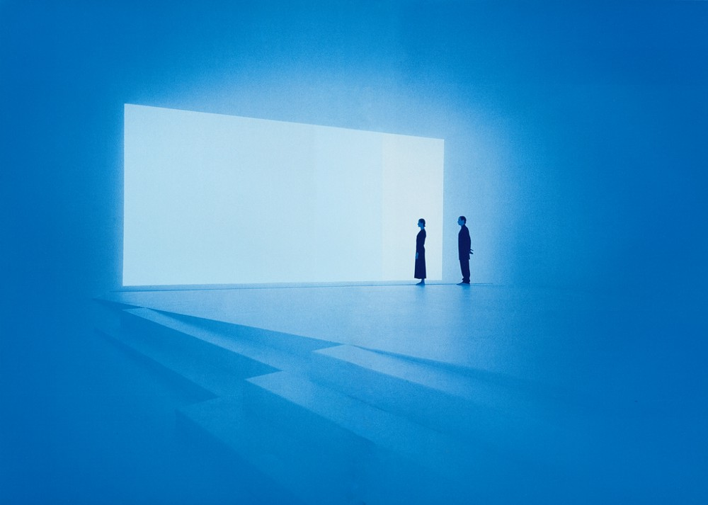
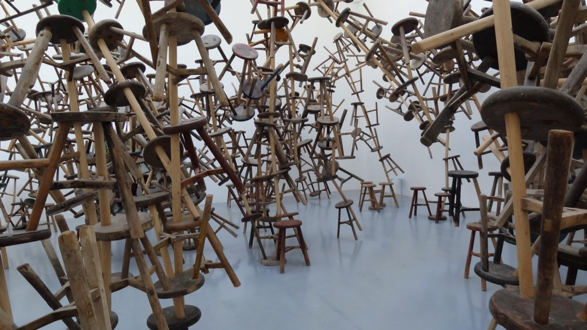
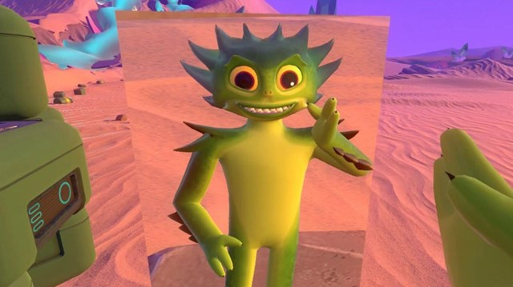
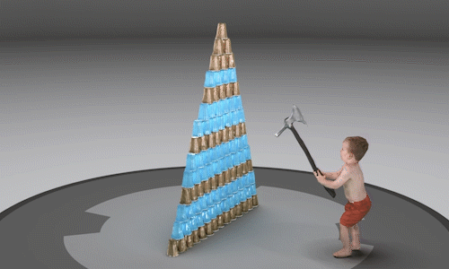
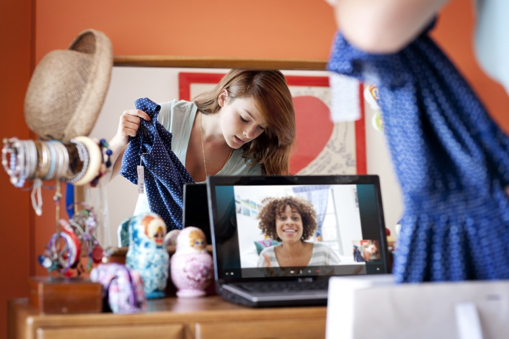

# Case study - Representing humans in mixed reality

James Turrell designs with light. Stepping into his work blurs one’s sense of depth and focus. Walls seem both close and infinite, brightness gives way to shadows. Unfamiliar perceptions designed by carefully balancing the light’s color and diffusion. [Turrell describes these sensations](https://www.sculpture.org/documents/scmag02/nov02/turrell/turrell.shtml) as *‘feeling with your eyes’*, a way of extending one’s understanding of reality. Fantastic worlds, like the ones Turrell imagines, are powerful tools to exploit our senses, not unlike the immersive environments of mixed reality today.

## How do you represent complex real-world environments in mixed reality?

Representing Turrell’s work in an immersive experience makes for a compelling challenge. Lighting, scale, and spatial audio present opportunities to represent his work. While the exhibit’s geometric surroundings would require relatively simple 3D modeling, they are secondary to the artist’s focus: the light’s impact on the senses.

Turrell’s stark, surreal minimalism is the hallmark of his work, but what if we wanted to represent an exhibit with more complex materials in mixed reality?

In 2013, the artist Ai Weiwei unveiled [a tangling work of art](https://www.designboom.com/art/ai-weiwei-bang-installation-at-venice-art-biennale-2013/) featuring 886 antique stools at the Venice Biennale. Each wooden stool came from an era where Chinese craftsmanship was highly valued, where these stools would have been passed down between generations. The stools themselves — the intricacies of the wood, the precision of the pieces, their careful placement — are critical to Ai’s commentary on modern culture.

The antique stools deliver the artist’s message through their authenticity. Their realistic representation is critical to the experience, creating a technical challenge: Sculpting each of the 886 stools by hand would be enormously exhaustive and expensive. How long would it take to model and position? How would you maintain the authenticity of the material? Recreating these objects from scratch becomes, in many ways, an interpretation of the artwork itself. How can you preserve the artist’s intent?

## Methods of capturing mixed reality assets

The alternative to creating something from scratch is capturing the real thing. Through an ever-advancing set of capture methods, we can develop authentic representations of each of the core asset types found in mixed reality (environments, objects, and people).

The broad categories range from well-established 2D video to the newest forms of volumetric video. In the case of Ai Weiwei’s exhibit, scanning (often referred to by its fundamental technique, photogrammetry) could be employed during the creation of the exhibit, scanning each of the stools themselves. 360° photo and video capture is another method for virtualizing the experience utilizing a high-quality omni-directional camera positioned throughout the exhibit. With these techniques, one begins to understand the sense of scale, ideally with enough detail to see each piece’s craftsmanship. All this while existing in a digital form that allows for new vistas and perspectives not possible in reality.

What kind of opportunities emerge when we cannot only create fantastic elements, but utilize the most realistic captures of environments, objects, and people in mixed reality? Exploring the overlap between these methods help illuminate where the medium is headed.

For environments and objects, 360° imaging software is evolving to include elements of photogrammetry. Isolating depth information from scenes, advanced 360° videos help alleviate the feeling of having your head stuck in a fishbowl when looking around a virtual scene.

For people, new methods are emerging that combine and extend motion capture and scanning: Motion capture has been foundational to bringing detailed human movement to visual effects and cinematic characters, while scanning has advanced to capture detailed human visuals like faces and hands. With advancements in rendering technology, a new method called volumetric video builds off these techniques, combining visual and depth information, to create the next generation of 3D human captures.

## Volumetric video and the pursuit of authentic human capture

Humans are central to storytelling — in the most literal sense: a human speaking, performing, or as the story’s subject. Some of the most immersive and eye-opening moments of today’s early immersive experiences are social. From sharing a mixed reality experience together in your living room, to seeing your friends in unbelievable new environments. The human element makes even the most fantastic reality, a reality.

Avatars in immersive experiences enable a new kind of embodiment in storytelling. The latest apps are rethinking the concept of virtual body ownership and setting up a generational leap in eliminating the distance between people. Companies like [Mindshow](https://mindshow.com/) are developing creative tools that leverage avatars, letting users take on entirely new personas and characters. Others are exploring [methods of artistic expression](https://en.wikipedia.org/wiki/Uncanny_valley), a potentially limitless creative opportunity to explore the nature (and necessity) of human-like attributes. Today, this absence of realism helps avoid the [uncanny valley of human likeness](https://en.wikipedia.org/wiki/Uncanny_valley) along with a host of technical issues for everyday developers. For these reasons (and more) it is very likely that non-realistic avatars will become the default for the foreseeable future. And yet, while realism poses an enormous challenge for mixed reality, *there are key scenarios that require authentic representation of humans in 3D space*.

At Microsoft, a small team borne out of Microsoft Research has spent the past several years developing a method for capturing humans through a form of volumetric video. The process today is similar to video production: rather than applying movement to a sculpted asset it is a full, 3D recording. The performance and the image are captured in real-time — it’s not the work of an artist, it’s an authentic representation. And while the technology is just beginning to expand into commercial applications, the implications of volumetric video are critical to [Microsoft’s vision of More Personal Computing](https://www.youtube.com/watch?v=tcyj-_IEWt8).

Authentic human capture unlocks new unique categories of experiences in mixed reality. Seeing someone you recognize, whether it’s a celebrity, a colleague, or a loved one, creates a depth of intimacy never before possible in a digital medium. Their face, their expressions, the nuance in their movements are all part of who they are. What opportunities unlock when we can capture these human qualities in 3D space?

Today the team is pushing the bounds of volumetric video by focusing on sectors like entertainment and education: [Actiongram](https://www.microsoft.com/p/actiongram/9nblggh5ftmt) features creative characters and [celebrities](https://www.youtube.com/watch?v=BwWueXlsOrA) to create mixed reality stories. [Destination: Mars exhibit](https://www.jpl.nasa.gov/news/news.php?feature=6220), now at NASA’s Kennedy Space Center, features a volumetric video of legendary astronaut Buzz Aldrin. The experience allows visitors to walk around the surface of Mars with Buzz as he introduces the pursuit of human colonization on Mars.

## Humans are fundamental to mixed reality

Designing ways to make these videos seem natural poses a challenge but one in which the team sees enormous potential. And these opportunities will expand as the technology becomes more accessible and moves from recordings to real-time capture.

[Holoportation](https://www.microsoft.com/research/project/holoportation-3/) is a research effort that builds upon the same fundamental technology, authentically capturing visual and depth information, and rendering the result in real-time. The team is exploring what the power of realistic human representation means for the future of conversations and shared experiences. What happens when a three-dimensional capture of someone, from anywhere in the world, can be added into your environment?

From layering a new level of immersion onto everyday apps like Skype, to radically reshaping the concept of digital meetings and business travel — volumetric video opens unique scenarios: A specialist virtually training doctors on a far-away continent or digital friends sitting on the couches and chairs in your living room. Adding authentic human representations to mixed reality experiences will radically reshape the concept of digital meetings and business travel.

Just as the abstract art of James Turrell and the critical realism of Ai Weiwei offer their own unique technical challenges, so do the methods to represent humans as creative avatars and realistic captures. One cannot be ignored in light of the other and exploring the potential of each will help us understand human interaction in this new space.

## About the author

<table style="border-collapse:collapse" padding-left="0px">
<tr>
<td style="border-style: none" width="60"></td>
<td style="border-style: none"><b>Mark Vitazko</b> UX Designer @Microsoft</td>
</tr>
</table>
