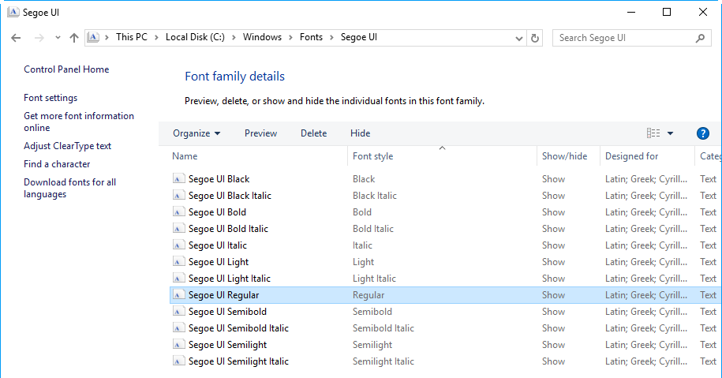
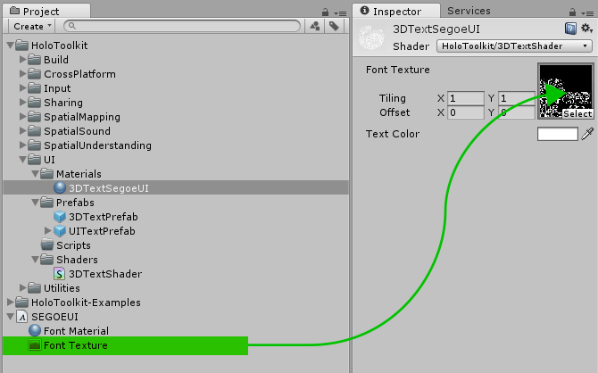
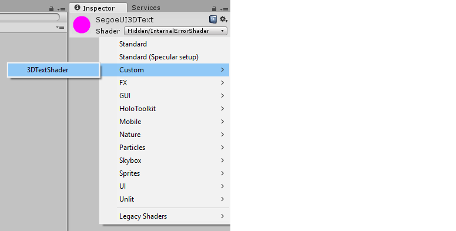
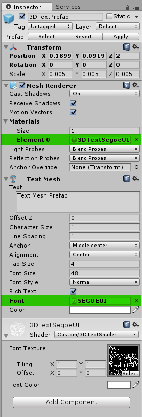
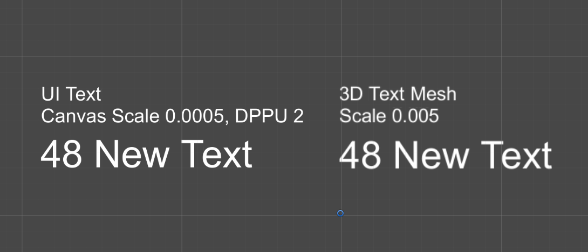
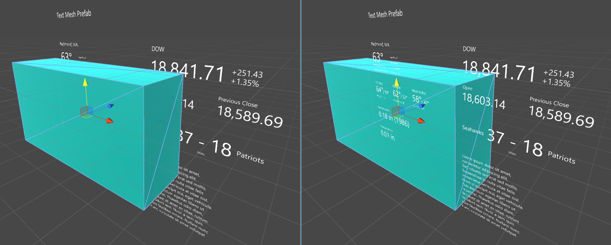

# Text prefab

These prefabs are optimized for the rendering quality in Windows Mixed Reality. For more information, please read the guideline [Text in Unity](https://docs.microsoft.com/windows/mixed-reality/text-in-unity) on Microsoft Windows Dev Center.

## Prefabs

### 3DTextPrefab

3D Text Mesh prefab (Assets/MRTK/SDK/StandardAssets/Prefabs/Text) with optimized scaling factor at 2-meter distance. (Please read the instructions below)

### UITextPrefab

UI Text Mesh prefab (Assets/MRTK/SDK/StandardAssets/Prefabs/Text) with optimized scaling factor at 2-meter distance. (Please read the instructions below)

## Fonts

Open-source fonts (Assets/MRTK/Core/StandardAssets/Fonts) included in Mixed Reality Toolkit.

> [!IMPORTANT]
> Text Prefab uses the open source font 'Selawik'. To use Text Prefab with a different font, please import the font file and follow the instructions below. Below example shows how to use 'Segoe UI' font with Text Prefab.

1. Assign font texture to 3DTextSegoeUI.mat material.

    

1. On 3DTextSegoeUI.mat material, select the shader Custom/3DTextShader.shader.

    

1. Assign Segoe UI font and 3DTextSegoeUI material to the text components in the prefabs.

    

### Working with Fonts in Unity

When adding a new 3D TextMesh to a scene in Unity there are two issues that are visually apparent. One, the font appears very large and two, the font appears very blurry. It is also interesting to notice that the default Font Size value is set to zero in the Inspector. Replacing this zero value with 13 will show no difference in size, because 13 is actually the default value.

Unity assumes all new elements added to a scene is 1 Unity Unit in size, or 100%  Transform scale, which translates to about 1 meter on the HoloLens. In the case of fonts, the bounding box for a 3D TextMesh comes in, by default at about 1 meter in height.

### Font Scale and Font Sizes

Most visual designers use Points to define font sizes in the real world, as well as their design programs. There are about 2835 (2,834.645666399962) points in 1 meter. Based on the point system conversion to 1 meter and Unity's default TextMesh Font Size of 13, the simple math of 13 divided by 2835 equals 0.0046 (0.004586111116 to be exact) provides a good standard scale to start with, though some may wish to round to 0.005.

Either way, scaling the Text object or container to these values will not only allow for the 1:1 conversion of font sizes from a design program, but also provides a standard to maintain consistency throughout the application or game.

### UI Text

When adding a UI or canvas based Text element to a scene, the size disparity is greater still. The differences in the two sizes is about 1000%, which would bring the scale factor for UI based Text components to 0.00046 (0.0004586111116 to be exact) or 0.0005 for the rounded value.

**Disclaimer**: The default value of any font may be effected by the texture size of that font or how the font was imported into Unity. These tests were performed based on the default Arial font in Unity, as well as one other imported font.

### [Text3DSelawik.mat](https://github.com/microsoft/MixedRealityToolkit-Unity/blob/mrtk_development/Assets/MRTK/StandardAssets/Materials/)

Material for 3DTextPrefab with occlusion support. Requires 3DTextShader.shader

### [Text3DShader.shader](https://github.com/microsoft/MixedRealityToolkit-Unity/tree/mrtk_development/Assets/MRTK/StandardAssets/Shaders)

Shader for 3DTextPrefab with occlusion support.
