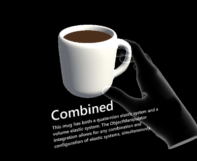
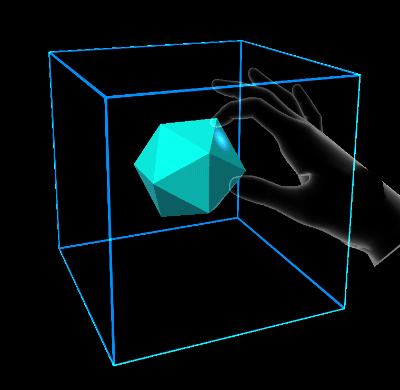
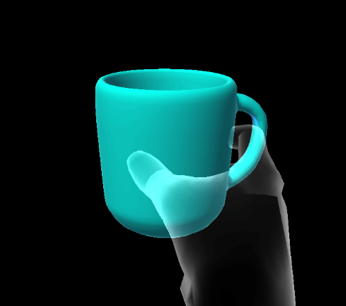
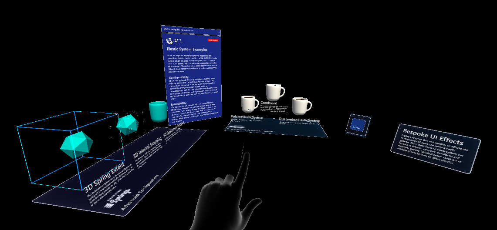

# Elastic system (experimental)

MRTK comes with an elastic simulation system that includes a wide variety of extensible and flexible subclasses, offering bindings for 4-dimensional quaternion springs, 3-dimensional volume springs and simple linear spring systems.

Currently the following MRTK components supporting the [elastics manager](xref:Microsoft.MixedReality.Toolkit.Experimental.Physics.ElasticsManager) can leverage elastics functionality:

- [Bounds control](../ux-building-blocks/bounds-control.md)
- [Object manipulator](../ux-building-blocks/object-manipulator.md)

## Elastics manager

The elastics manager processes passed transforms and feeds them into the elastics system.

Enabling elastics for custom components can be achieved by two steps:

1. Calling the Initialize method on manipulation start, updating the system with the current host transform.
1. Querying ApplyHostTransform whenever a elastics calculation should be performed on the updated target transform.

Note that elastics will continue simulating once manipulation ends (through the elastics manager update loop). To block the behavior, elastics auto update [EnableElasticsUpdate](xref:Microsoft.MixedReality.Toolkit.Experimental.Physics.ElasticsManager.EnableElasticsUpdate) can be set to false.

By default, the elastics manager component, when added to a game object, won't have elastics enabled for any transforms type.
The field `Manipulation types using elastic feedback` needs to be enabled for specific transform types to create elastics configuration and extents for the selected type.

### Elastics configurations

Similar to [bounds control configurations](../ux-building-blocks/bounds-control.md#configuration-objects), elastic manager comes with a set of configuration objects that can be stored as scriptable objects and shared between different instances or prefabs. Configurations can be shared and linked either as individual scriptable asset files or nested scriptable assets inside of prefabs. Further configurations can also be defined directly on the instance without linking to an external or nested scriptable asset.

The elastics manager inspector will indicate whether a configuration is shared or inlined as part of the current instance by showing a message in the property inspector. In addition, shared instances won't be editable directly in the elastics manager property window itself, but instead the asset it's linking to has to be directly modfied to avoid any accidental changes on shared configurations.

Elastics manager offers configuration objects options for the following transform types, each of them represented by a [elastic configuration object](#elastic-configuration-object):

- Translation Elastic
- Rotation Elastic
- Scale Elastic

#### Elastic configuration object

A elastics configuration defines properties for a damped harmonic oscillator differential system.
The following properties can be adjusted but already come with a set of defaults in MRTK:

- **Mass**: mass of the simulated oscillator element.
- **HandK**: hand spring constant.
- **EndK**: end cap spring constant.
- **SnapK**: snap point spring constant.
- **Drag**: drag/damper factor, proportional to velocity.

### Elastics extents

Elastics extents settings vary depending on the type of manipulation. Translation and scale are represented by [volume elastic extents](#volume-elastic-extent) and rotation is represented by a [quaternion elastic extent](#quaternion-elastic-extent).

#### Volume elastic extent

Volume extents define a three dimensional space in which the damped harmonic oscillator is free to move.

- **StretchBounds**: represents the lower bounds of the elastic space.
- **UseBounds**: whether the stretch bounds should be respected by the system. If true, when the current iteration of the target position is outside the stretch bounds, the end force will be applied.
- **SnapPoints**: points inside the space to which the system will snap.
- **RepeatSnapPoints**: repeats the snap points to infinity. Existing snap points will serve as a modulo where the actual snap points are mapped to the closest integer multiples of every snap point.
- **SnapRadius**: distance at which snap points begin forcing the spring.

#### Quaternion elastic extent

Quaternion extents define a four dimensional rotation space in which the damped harmonic oscillator is free to rotate.

- **SnapPoints**: euler angles to which the system will snap.
- **RepeatSnapPoints**: repeats the snap points. Existing snap points will serve as a modulo where the actual snap points are mapped to the closest integer multiples of every snap point.
- **SnapRadius**: arc-angle at which snap points begin forcing the spring in euler degrees.

## Elastics example scene

You can find examples of elastics configurations in the `ElasticSystemExample` scene.

